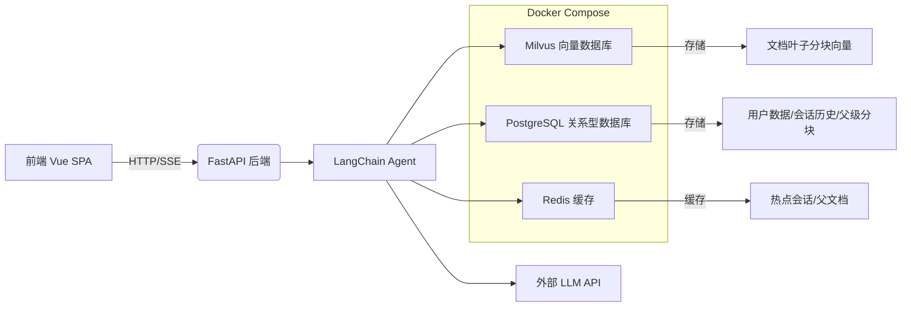

欢迎来到医疗智能助理项目！本文档旨在为初学者提供一个清晰、全面的项目鸟瞰图，帮助您快速理解其核心目标、架构组成和关键能力。本项目是一个集成了检索增强生成（RAG）、智能体（Agent）技术和医疗领域知识的对话系统，致力于提供专业、准确且可追溯的医疗健康咨询服务。

## 核心目标与功能

SuperMew 项目的核心目标是构建一个**安全、可靠、可解释**的个人医疗助理。它不仅仅是一个简单的问答机器人，而是通过结合用户上传的私人文档（如体检报告、病历）和内置的医疗知识库，为用户提供个性化的健康信息查询服务。其主要功能包括：

1.  **智能问答**：用户可以就疾病、药品、症状等医疗相关问题进行提问。
2.  **文档知识库**：支持用户上传个人医疗文档，系统会自动解析、分块并建立索引，后续问答可基于这些私有知识。
3.  **意图识别**：能够精准识别用户问题背后的多种潜在意图（如查询病因、治疗方法、所需药品等），从而提供更全面的回答。
4.  **来源追溯**：所有回答都基于检索到的信息生成，并能在前端清晰地展示信息来源，确保回答的可验证性和可信度。

Sources: [README.md](README.md#L78-L90)

## 整体架构

SuperMew 采用了一个清晰的前后端分离架构，后端以 Python 的 FastAPI 框架为核心，前端则是一个轻量级的单页应用（SPA）。整个系统围绕着一个强大的 LangChain Agent 工作流构建，该工作流负责协调检索、推理和生成等复杂任务。



如上图所示，用户的请求首先到达 FastAPI 后端，后端将任务交由 LangChain Agent 处理。Agent 会根据需要，从 Milvus（用于高效向量检索）、PostgreSQL（用于结构化数据存储）和 Redis（用于高速缓存）中获取信息，并最终调用大语言模型（LLM）API 生成回答。所有依赖服务（数据库、缓存、向量库）均通过 `docker-compose.yml` 文件统一管理，极大地简化了部署流程。

Sources: [backend/app.py](backend/app.py#L1-L58), [README.md](README.md#L28-L60)

## 项目目录结构

了解项目的文件组织是深入代码的第一步。以下是 SuperMew 项目的关键目录及其作用：

```
.
├── backend/            # 后端核心逻辑
│   ├── app.py          # FastAPI 应用入口与配置
│   ├── api.py          # 所有 API 路由定义
│   ├── agent.py        # LangChain Agent 的核心实现
│   └── ...             # 数据库、认证、RAG 管道等模块
├── frontend/           # 前端静态资源 (HTML, JS, CSS)
├── medical/            # 医疗领域特定逻辑
│   ├── webui.py        # Streamlit UI (可能为早期原型或独立工具)
│   ├── ner_model.py    # 命名实体识别 (NER) 模型
│   └── memory/         # 会话记忆管理相关
├── docker-compose.yml  # 依赖服务 (Postgres, Redis, Milvus) 的容器编排文件
└── README.md           # 项目说明与部署指南
```

值得注意的是，`medical/` 目录包含了项目在医疗领域的专有逻辑，例如使用 BERT 模型进行医疗命名实体识别（NER）和复杂的意图识别。而后端的 `agent.py` 和 `rag_pipeline.py` 等文件则实现了通用的 RAG 和 Agent 框架，两者协同工作以提供专业的医疗服务。

Sources: [README.md](README.md), [backend/app.py](backend/app.py), [medical/webui.py](medical/webui.py#L1-L200)

## 下一步阅读建议

您现在已经对项目有了一个宏观的认识。为了更深入地了解如何运行和使用这个系统，请继续阅读以下文档：

- 想要立刻在本地运行项目？请前往 **[快速开始](2-kuai-su-kai-shi)**。
- 想要详细了解环境配置和依赖安装？请查阅 **[环境准备与依赖安装](3-huan-jing-zhun-bei-yu-yi-lai-an-zhuang)**。
- 对 Docker 部署方式感兴趣？请参考 **[Docker Compose 服务部署](4-docker-compose-fu-wu-bu-shu)**。