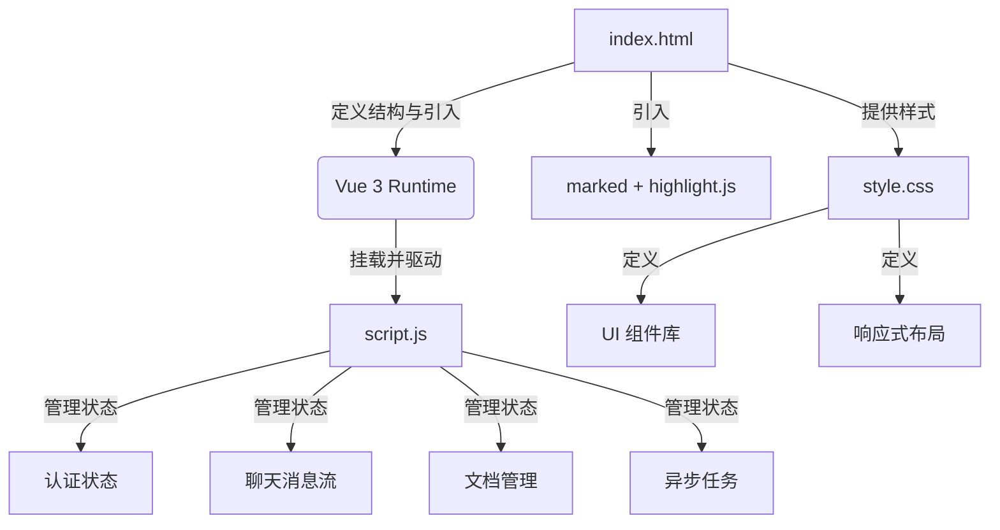

本页面深入剖析医疗助理项目的前端架构设计与核心交互逻辑。项目采用极简的单页应用（SPA）模式，通过现代浏览器原生能力与轻量级框架实现丰富的用户体验，包括流式对话、实时 RAG 可视化、文档管理等核心功能。

## 架构概览：Vue 3 驱动的单页应用

前端架构遵循经典的 MVVM 模式，以 **Vue 3** 作为响应式核心，通过其 Composition API 的简化形式（Options API）管理复杂的状态和交互。整个应用由三个核心文件构成：`index.html` 定义结构与依赖，`script.js` 实现所有业务逻辑，`style.css` 提供完整的视觉样式。这种“三件套”模式确保了架构的简洁性与可维护性。

应用的核心是一个名为 `#app` 的 Vue 实例，它挂载在 HTML 的根容器上，并通过响应式数据驱动整个 UI。关键状态如用户认证信息 (`token`, `currentUser`)、聊天消息 (`messages`)、文档列表 (`documents`) 和上传/删除任务状态 (`uploadSteps`, `deleteJobs`) 都集中在此实例中管理，保证了数据流的单一性和可预测性。

Sources: [index.html](frontend/index.html#L1-L20), [script.js](frontend/script.js#L1-L30)

## 核心交互：流式对话与实时中断

流式对话是本系统的核心体验，其实现依赖于浏览器的 **Fetch API** 与 **ReadableStream** 接口。当用户发送消息时，前端向 `/chat/stream` 端点发起一个 POST 请求，并传入 `AbortController` 信号以支持中断。后端通过 Server-Sent Events (SSE) 协议，以 `data: {...}\n\n` 的格式分块推送内容。

前端通过 `TextDecoder` 实时解析接收到的字节流，并根据 JSON 数据的 `type` 字段进行差异化处理：
- `content`: 追加到当前 AI 消息的文本内容。
- `trace`: 更新当前消息的 RAG 检索溯源信息。
- `rag_step`: 记录 RAG 流程中的各个步骤，用于后续可视化。
- `error`: 处理流式过程中的错误。

用户可以通过点击“停止”按钮触发 `abort()`，前端会优雅地处理 `AbortError`，并在消息末尾添加终止提示。这种设计确保了即使在网络延迟或长思考链路下，用户也能保持对交互的完全控制。

Sources: [script.js](frontend/script.js#L180-L299)

## 文档知识库管理：异步任务与进度可视化

文档上传与删除是典型的耗时操作，前端通过 **轮询机制** 实现了精细的进度可视化。当用户上传文件时，首先通过 `XMLHttpRequest` 的 `upload.onprogress` 事件监控文件传输进度。文件上传成功后，后端返回一个唯一的 `job_id`，前端随即启动一个定时器（`setInterval`），定期向 `/documents/upload/jobs/{job_id}` 发起查询。

后端的异步任务系统会返回包含多个步骤（如“解析与分块”、“向量化入库”）及其进度百分比的详细状态。前端将这些数据同步到 `uploadSteps` 数组，并通过 Vue 的响应式系统实时更新 UI。每个步骤都有明确的状态（`pending`/`running`/`completed`/`failed`）和描述信息，为用户提供了透明的操作反馈。

删除操作采用了相同的模式，但步骤略有不同（如“同步 BM25 统计”、“删除向量数据”）。为了防止重复操作，前端在任务运行期间会禁用相关按钮，并在任务完成后短暂保留摘要信息再从列表中移除，提升了用户体验的流畅性。

Sources: [script.js](frontend/script.js#L500-L750), [index.html](frontend/index.html#L100-L200)

## 用户认证与路由导航

应用内建了完整的用户认证流程，包括登录、注册和权限管理。认证状态 (`isAuthenticated`) 是一个计算属性，基于 `localStorage` 中存储的 `accessToken` 和 `currentUser` 对象。未认证用户只能看到登录/注册面板，所有其他功能（如新建会话、文档管理）都被 `v-if` 指令条件渲染所保护。

导航通过 `activeNav` 状态变量控制，实现了无刷新的 SPA 路由效果。侧边栏的按钮点击会改变 `activeNav` 的值，从而切换主内容区显示的组件（聊天界面、历史记录、病历记忆管理、用药说明管理）。这种基于状态的导航模式简单高效，避免了引入复杂的路由库，符合项目的轻量化原则。

Sources: [script.js](frontend/script.js#L30-L50), [index.html](frontend/index.html#L40-L80)

## 下一步阅读建议

- 想了解后端如何支撑这些前端交互？请阅读 [后端整体架构 (FastAPI + LangGraph)](9-hou-duan-zheng-ti-jia-gou-fastapi-langgraph)。
- 对流式对话背后的 RAG 技术细节感兴趣？请深入 [混合检索：稠密向量与 BM25 稀疏向量](12-hun-he-jian-suo-chou-mi-xiang-liang-yu-bm25-xi-shu-xiang-liang) 和 [三级分块与 Auto-merging 策略](13-san-ji-fen-kuai-yu-auto-merging-ce-lue)。
- 想知道用户会话历史是如何被持久化和管理的？请查阅 [会话历史持久化与缓存](24-hui-hua-li-shi-chi-jiu-hua-yu-huan-cun)。