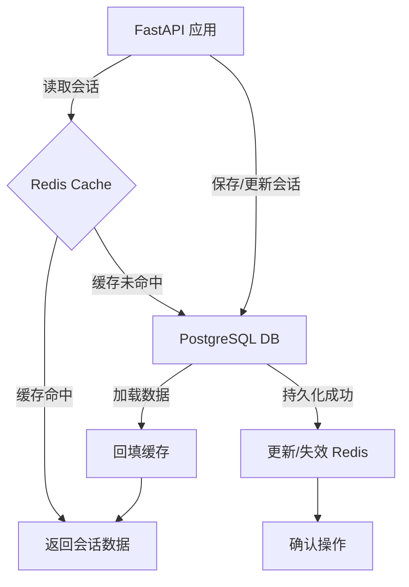

本文档深入解析 Medical-Assistant 项目中 PostgreSQL 与 Redis 的协同设计。系统采用 **PostgreSQL 作为持久化核心**，负责存储用户、会话、消息及文档分块等关键业务数据；同时引入 **Redis 作为高性能缓存层**，显著加速会话历史与列表的读取操作，减轻数据库负载。这种组合确保了数据的一致性与高可用性，并为实时对话体验提供了低延迟保障。

## 核心架构与数据流

系统的数据存储架构遵循清晰的分层原则。后端通过 SQLAlchemy ORM 与 PostgreSQL 进行交互，所有写入操作（如保存新消息或创建会话）都直接持久化到数据库。与此同时，一个精心设计的 Redis 缓存策略被用于读取密集型操作。当请求特定会话的消息历史时，系统首先查询 Redis；若缓存未命中，则回源至 PostgreSQL 加载数据，并将结果回填至缓存以供后续请求使用。任何对会话数据的修改都会触发相应缓存条目的失效或更新，从而保证数据的最终一致性。

Sources: [database.py](backend/database.py#L1-L23), [cache.py](backend/cache.py#L1-L56), [agent.py](backend/agent.py#L30-L130)

## PostgreSQL 数据模型详解

PostgreSQL 中定义了四个核心表，共同支撑起应用的业务逻辑。这些模型通过 SQLAlchemy 的声明式基类 `Base` 定义，并在应用启动时通过 `init_db()` 函数自动创建。

- **`users` 表**: 存储用户凭证和角色信息。
- **`chat_sessions` 表**: 管理会话元数据，通过外键关联到 `users` 表，并包含一个针对 `(user_id, session_id)` 的唯一约束，确保每个用户的会话ID唯一。
- **`chat_messages` 表**: 存储每条对话消息的具体内容、类型及可选的 RAG 追踪信息（`rag_trace` 字段），并通过外键与 `chat_sessions` 表级联删除。
- **`parent_chunks` 表**: 专门用于持久化文档处理流程中生成的父级文本分块，包含文件来源、层级结构等丰富元数据，为 RAG 检索提供上下文支持。

此设计确保了数据的完整性与关联性，例如，删除一个用户会自动级联删除其所有会话和消息。

Sources: [models.py](backend/models.py#L1-L64)

## Redis 缓存策略实现

Redis 缓存由 `RedisCache` 类封装，提供了一套简洁的 JSON 序列化接口。该类从环境变量中读取连接配置（`REDIS_URL`）、键前缀（`REDIS_KEY_PREFIX`）和默认过期时间（`REDIS_CACHE_TTL_SECONDS`），增强了部署的灵活性。

缓存主要服务于两大场景：
1.  **会话消息缓存**: 键格式为 `supermew:chat_messages:{user_id}:{session_id}`，值为序列化后的消息列表。
2.  **用户会话列表缓存**: 键格式为 `supermew:chat_sessions:{user_id}`，值为该用户所有会话的摘要信息。

在 `ChatHistorySaverLoader` 类中，`save` 方法在成功将数据写入 PostgreSQL 后，会立即更新对应会话的消息缓存，并主动删除用户的会话列表缓存（因为新增或修改会话会改变列表内容）。`load` 和 `list_session_infos` 方法则优先尝试从缓存中读取，仅在缓存失效时才查询数据库并回填。这种“写时更新，读时回源”的策略有效平衡了性能与一致性。

| 缓存键类型 | 键模板 | 缓存内容 | 失效时机 |
| :--- | :--- | :--- | :--- |
| 会话消息 | `chat_messages:{user_id}:{session_id}` | 消息记录列表 | 对应会话被修改或删除时 |
| 会话列表 | `chat_sessions:{user_id}` | 用户会话摘要列表 | 用户的任一会话被创建、修改或删除时 |

Sources: [cache.py](backend/cache.py#L1-L56), [agent.py](backend/agent.py#L103-L104), [agent.py](backend/agent.py#L110-L115)

## 初始化与依赖管理

应用的数据库连接池和缓存客户端均在模块级别进行初始化。`backend/database.py` 文件创建了 SQLAlchemy 引擎 (`engine`) 和会话工厂 (`SessionLocal`)，而 `backend/cache.py` 则实例化了一个全局的 `RedisCache` 对象 (`cache`)。FastAPI 应用在启动时（`backend/app.py`）会调用 `init_db()` 函数，确保数据库表结构已就绪。各业务模块（如 `agent.py`, `auth.py`）通过导入这些全局对象来获取数据库会话或执行缓存操作，实现了依赖的集中管理和高效复用。