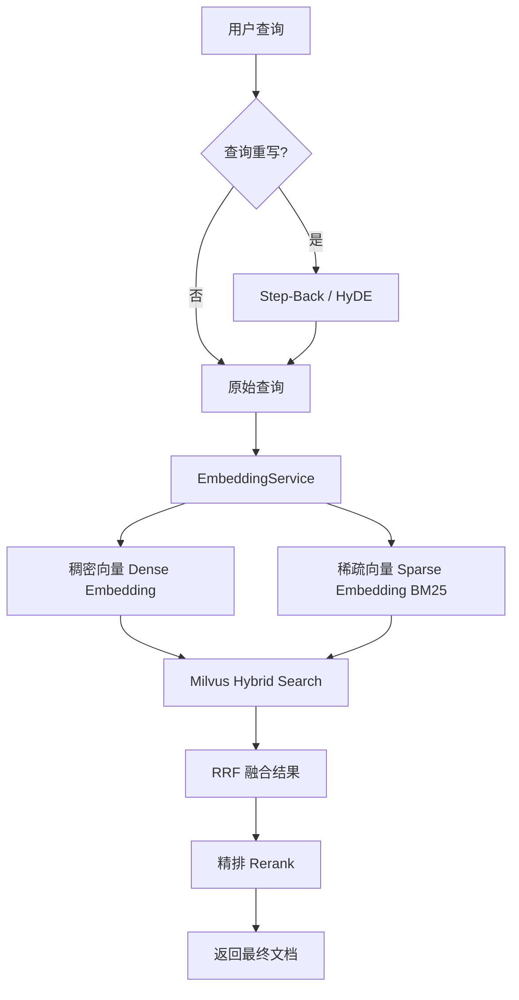

本页深入解析 Medical-Assistant 项目中混合检索的核心实现机制。系统采用 **稠密向量（Dense Embedding）** 与 **BM25 稀疏向量（Sparse Embedding）** 相结合的策略，通过 Milvus 的原生混合检索能力，有效融合语义相似性与关键词精确匹配的优势，显著提升医疗领域问答的召回率与准确性。

## 架构概览

混合检索流程始于用户查询，经过查询重写（如 Step-Back、HyDE）后，由 `EmbeddingService` 同时生成稠密和稀疏向量。这两个向量被送入 Milvus 的 `hybrid_search` 接口，使用 RRF（Reciprocal Rank Fusion）算法进行结果融合，最终返回排序后的文档片段。整个过程支持双知识库（病历 `medical_record` 和药品 `medication`）并行检索，并具备完善的降级机制。

Sources: [rag_utils.py](backend/rag_utils.py#L268-L300), [milvus_client.py](backend/milvus_client.py#L217-L290)

## 核心组件：EmbeddingService 与 BM25 实现

`EmbeddingService` 是混合检索的基石，它负责生成两种类型的向量。稠密向量由本地 HuggingFace 模型（默认 `BAAI/bge-m3`）生成，而稀疏向量则基于经典的 BM25 算法实现。

该服务的关键创新在于 **BM25 统计信息的持久化与增量更新**。系统为两个知识库（`medical_record` 和 `medication`）分别维护独立的词表（vocab）、文档频率（df）和总文档数（N）。每当有新文档上传或旧文档删除时，`increment_add_documents` 和 `increment_remove_documents` 方法会精确地更新这些统计量，并将状态持久化到 JSON 文件（如 `bm25_state_medical_record.json`）中。这确保了 BM25 的稀疏向量能始终反映当前知识库的真实状态，避免了因统计偏差导致的检索质量下降。

在分词层面，服务采用 `jieba` 进行中文分词，而非简单的字符切分，这更符合中文语言习惯，能生成更具语义意义的关键词。

Sources: [embedding.py](backend/embedding.py#L1-L234)

## Milvus 混合检索执行

`MilvusManager` 封装了与 Milvus 数据库的所有交互。其 `hybrid_retrieve` 方法是混合检索的核心执行者。

该方法首先为稠密向量和稀疏向量分别构建 `AnnSearchRequest`。稠密向量使用 HNSW 索引进行近似最近邻搜索，稀疏向量则利用 SPARSE_INVERTED_INDEX 索引。两个请求被同时提交给 Milvus 的 `hybrid_search` API，并指定 `RRFRanker` 作为融合器。RRF 算法通过综合两项检索结果的排名，计算出一个融合分数，从而得到最终的排序列表。此设计充分利用了 Milvus 对混合检索的原生支持，高效且稳定。

为了应对潜在的异常（如稀疏向量服务暂时不可用），系统还实现了降级机制。如果混合检索失败，`_retrieve_from_kb` 函数会自动回退到仅使用稠密向量的 `dense_retrieve` 方法，保证了服务的可用性。

Sources: [milvus_client.py](backend/milvus_client.py#L217-L290), [rag_utils.py](backend/rag_utils.py#L268-L285)

## 检索流程整合与后续处理

完整的检索流程由 `rag_utils.py` 中的 `retrieve_documents` 函数协调。它首先根据配置决定检索哪些知识库（默认同时检索病历和药品库），然后对每个知识库调用 `_retrieve_from_kb` 执行混合检索（或降级检索）。

检索到的候选文档会经历两个关键的后处理步骤：
1.  **三级分块 Auto-merging**: 如果多个子分块（L3）被召回，且数量超过阈值（默认为2），系统会自动将其合并为其父分块（L2 或 L1），以提供更完整、上下文更丰富的信息。
2.  **Jina Rerank 精排**: 合并后的文档会被发送到外部的 Jina Rerank 服务进行精排，进一步提升排序质量。

下表总结了混合检索流程中的关键配置项及其作用：

| 配置项 | 默认值 | 说明 |
| :--- | :--- | :--- |
| `AUTO_MERGE_ENABLED` | `true` | 是否启用三级分块自动合并功能 |
| `AUTO_MERGE_THRESHOLD` | `2` | 触发自动合并所需的子分块最小数量 |
| `RERANK_MODEL` | (环境变量) | Jina Rerank 使用的模型名称 |
| `RERANK_BINDING_HOST` | (环境变量) | Jina Rerank 服务的 API 地址 |
| `LEAF_RETRIEVE_LEVEL` | `3` | 检索时从哪一级分块（L3）开始 |

Sources: [rag_utils.py](backend/rag_utils.py#L1-L355)

## 下一步阅读建议

混合检索的结果质量高度依赖于输入文档的分块策略。要全面理解为何以及如何进行三级分块，请继续阅读 `[三级分块与 Auto-merging 策略](13-san-ji-fen-kuai-yu-auto-merging-ce-lue)`。若想了解检索前的查询优化技术，如 Step-Back 和 HyDE，请参阅 `[查询重写：Step-Back 与 HyDE](15-cha-xun-zhong-xie-step-back-yu-hyde)`。对于 BM25 统计信息如何与文档生命周期同步的细节，请查阅 `[BM25 统计信息的持久化与同步](23-bm25-tong-ji-xin-xi-de-chi-jiu-hua-yu-tong-bu)`。