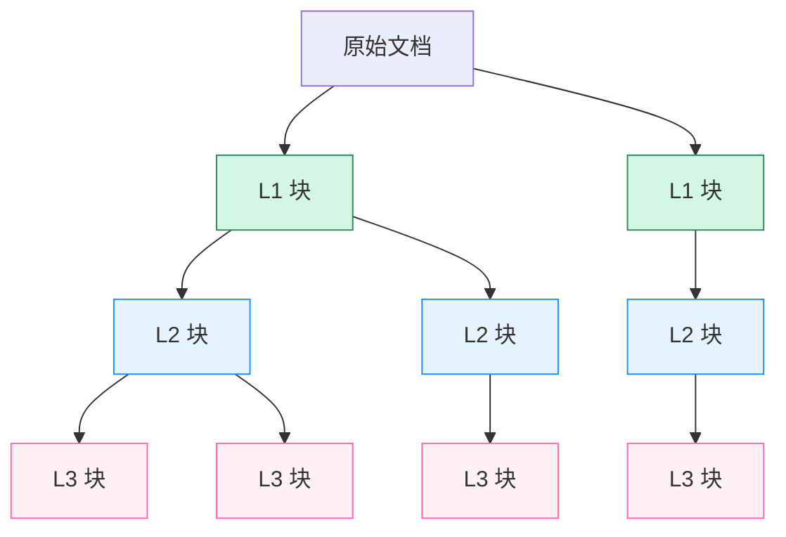

本页详细阐述了医疗助手项目中用于优化检索效果的核心文档处理策略：**三级分块（Three-level Chunking）** 与 **自动合并（Auto-merging）**。该策略旨在平衡检索的精确性与上下文的完整性，通过多层次的文档切分和智能的检索后处理，确保大语言模型能够获得既相关又连贯的信息片段。

## 三级分块架构设计

系统的文档分块采用三层递进式结构，每一层服务于不同的检索需求。在文档加载阶段，原始文档首先被切分为较大的一级块（Level 1），每个一级块再被递归切分为更小的二级块（Level 2），最后二级块被进一步切分为最小的三级块（Level 3）。这种设计确保了信息粒度的层次化。

具体实现上，`DocumentLoader` 类定义了三个不同参数的 `RecursiveCharacterTextSplitter`：
- **一级块 (L1)**: 最大（默认约1200字符），作为完整上下文单元。
- **二级块 (L2)**: 中等（默认约600字符），作为中间粒度单元。
- **三级块 (L3)**: 最小（默认约300字符），作为高精度检索单元。

每个分块都包含关键元数据：
- `chunk_id`: 全局唯一ID，编码了知识库类型、文件名、页码、层级和索引。
- `parent_chunk_id`: 指向其直接父块的ID（L2的父是L1，L3的父是L2）。
- `root_chunk_id`: 始终指向其所属的一级块（L1）ID。
- `chunk_level`: 明确标识块的层级（1, 2, 或 3）。

此结构为后续的自动合并提供了必要的父子关系链路。

Sources: [document_loader.py](backend/document_loader.py#L15-L50)

## Auto-merging 自动合并机制

Auto-merging 是一种检索后处理策略，旨在解决“信息碎片化”问题。当用户的查询导致多个高度相关的子块（如L3）被检出，且这些子块同属于一个父块时，系统会用其父块（如L2）替代这些子块。这能为大模型提供更完整、连贯的上下文，避免因信息割裂而产生错误理解。

该机制由 `_auto_merge_documents` 函数驱动，其核心逻辑如下：
1.  **配置检查**: 首先检查环境变量 `AUTO_MERGE_ENABLED` 是否启用（默认为true）。
2.  **阈值判断**: 根据环境变量 `AUTO_MERGE_THRESHOLD`（默认为2）判断是否触发合并。即，只有当一个父块下有至少N个子块被检出时，才进行合并。
3.  **两阶段合并**: 执行两次合并操作：
    -   **第一阶段 (L3 -> L2)**: 将满足阈值的L3子块合并为其L2父块。
    -   **第二阶段 (L2 -> L1)**: 将新产生的L2块（包括未被合并的原始L2和由L3合并来的L2）再次检查，将满足阈值的L2块合并为其L1父块。
4.  **去重与排序**: 合并后的结果会进行去重，并根据相关性分数重新排序，最终返回给用户。

此过程依赖于 `ParentChunkStore` 服务，该服务从 PostgreSQL 数据库（并辅以 Redis 缓存）中高效地获取父块的完整内容。

Sources: [rag_utils.py](backend/rag_utils.py#L65-L119), [parent_chunk_store.py](backend/parent_chunk_store.py)

## 存储与元数据管理

为了支持高效的 Auto-merging，系统需要持久化存储所有非叶子节点（即L1和L2块）的完整信息。在文档上传流程中，`api.py` 会识别出 `chunk_level` 为1或2的文档，并调用 `ParentChunkStore.upsert_documents` 方法将其写入数据库。

`ParentChunk` 模型在 PostgreSQL 中对应 `parent_chunks` 表，完整存储了包括文本内容在内的所有元数据。`ParentChunkStore` 类封装了数据库和缓存的交互逻辑，提供了 `upsert_documents`、`get_documents_by_ids` 和 `delete_by_filename` 等关键方法，确保了在检索时能毫秒级地获取到所需的父块内容。

| **元数据字段** | **描述** | **示例** |
| :--- | :--- | :--- |
| `chunk_id` | 分块全局唯一ID | `medical_record::病历.pdf::p1::l1::0` |
| `parent_chunk_id` | 父分块ID | `medical_record::病历.pdf::p1::l1::0` |
| `root_chunk_id` | 根分块（L1）ID | `medical_record::病历.pdf::p1::l1::0` |
| `chunk_level` | 分块层级 | `1`, `2`, `3` |
| `kb_type` | 知识库类型 | `medical_record`, `instruction_manual` |

Sources: [api.py](backend/api.py#L300-L310), [models.py](backend/models.py#L120-L130), [parent_chunk_store.py](backend/parent_chunk_store.py#L15-L30)

## 工作流程与集成

整个三级分块与 Auto-merging 策略无缝集成在 RAG 流水线中：
1.  **上传阶段**: 文档被 `DocumentLoader` 切分为 L1/L2/L3 三级块。所有块被送入 Milvus 向量库进行索引，同时 L1/L2 块被存入 `ParentChunkStore`。
2.  **检索阶段**: 用户查询首先在 Milvus 中检索，默认返回最精细的 L3 块。
3.  **后处理阶段**: 检索结果进入 `_auto_merge_documents` 函数。函数根据配置和阈值，动态地将 L3 合并为 L2，或将 L2 合并为 L1。
4.  **生成阶段**: 经过合并处理后的、上下文更完整的块被送入大语言模型，用于生成最终回答。

此策略显著提升了模型在处理需要长距离依赖或完整段落信息的复杂医疗查询时的表现。