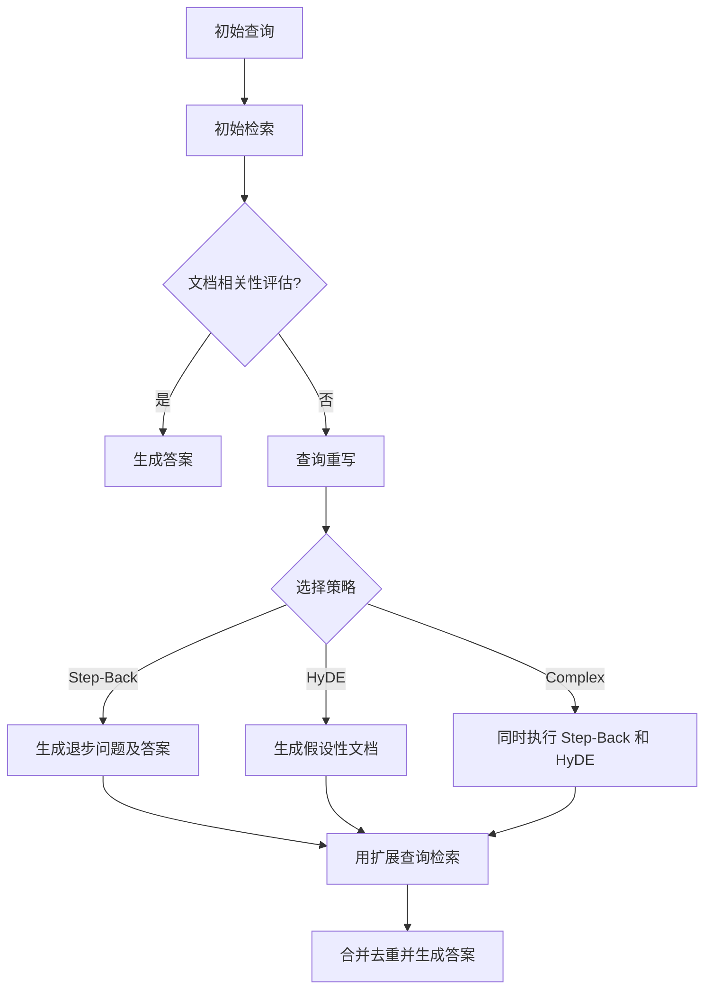

在医疗问答场景中，用户原始查询往往存在信息不足、过于具体或表述模糊等问题，直接检索可能导致相关文档召回失败。本系统通过 **Step-Back（退步提问）** 和 **HyDE（假设性文档嵌入）** 两种查询重写策略，在文档相关性评估失败后动态扩展查询语义，显著提升检索召回率和答案准确性。

## 核心策略架构与工作流

系统采用 LangGraph 构建的 RAG 工作流，在 `grade_documents_node` 评估初始检索结果相关性后，若判定为“不相关”，则触发 `rewrite_question_node` 进行查询重写。该节点首先通过路由模型智能选择重写策略（`step_back`、`hyde` 或 `complex`），然后执行相应的查询扩展逻辑，并在 `retrieve_expanded` 节点使用扩展后的查询进行二次检索。

Sources: [rag_pipeline.py](backend/rag_pipeline.py#L350-L420)

## Step-Back（退步提问）机制详解

Step-Back 策略专为处理包含具体细节（如药品名、日期、代码）但缺乏通用背景知识的问题而设计。其核心思想是先将具体问题抽象为一个更高层次的通用问题（退步问题），然后回答这个通用问题，最后将原始问题、退步问题及其答案三者拼接成新的扩展查询。

该机制由 `rag_utils.py` 中的三个关键函数实现：
1. `_generate_step_back_question`: 使用大模型将用户问题抽象为一句通用的“退步问题”。
2. `_answer_step_back_question`: 使用大模型简要回答上述退步问题，提供必要的背景知识。
3. `step_back_expand`: 整合以上两步，返回完整的扩展查询字符串。

例如，面对“阿司匹林在2023年FDA的最新指南中对于二级预防的推荐剂量是多少？”这一问题，Step-Back 会先生成退步问题“阿司匹林在心血管疾病二级预防中的作用机制和一般推荐剂量是什么？”，并给出答案，最终形成包含原始细节和通用背景的复合查询。

Sources: [rag_utils.py](backend/rag_utils.py#L220-L260)

## HyDE（假设性文档嵌入）机制详解

HyDE 策略适用于模糊、概念性或需要解释定义的问题。它不直接改写查询，而是让大模型基于用户问题生成一段“假设性文档”（Hypothetical Document）。这段文档模拟了理想情况下应被检索到的相关内容，然后系统对这段假设性文档进行向量化，并用其向量在知识库中进行检索。

该机制由 `rag_utils.py` 中的 `generate_hypothetical_document` 函数实现。该函数提示大模型生成一段与问题语义高度相关的、类似真实资料片段的文本。由于假设性文档包含了对问题的潜在解答，其嵌入向量往往能更精准地匹配到知识库中的真实相关文档。

例如，对于“什么是慢性阻塞性肺疾病的 GOLD 分期？”这样的问题，HyDE 会生成一段描述 GOLD 分期标准的假设性文本，然后用这段文本去检索，从而找到官方指南中的精确描述。

Sources: [rag_utils.py](backend/rag_utils.py#L262-L276)

## 策略选择与多路召回

系统并非固定使用单一策略，而是通过一个轻量级的路由模型在 `rewrite_question_node` 中动态决策。根据问题特性，模型会选择 `step_back`、`hyde` 或 `complex`（同时启用两者）策略。

在 `retrieve_expanded` 节点，系统会根据所选策略执行相应的检索：
- 对于 `step_back` 或 `complex`，使用 `step_back_expand` 生成的 `expanded_query` 进行检索。
- 对于 `hyde` 或 `complex`，使用 `generate_hypothetical_document` 生成的 `hypothetical_doc` 进行检索。

当策略为 `complex` 时，系统会并行执行两种检索，并将结果合并、去重，形成最终的上下文。这种多路召回机制确保了在复杂场景下也能获得全面的信息覆盖。

| 策略 | 适用问题类型 | 扩展方式 | 检索输入 |
| :--- | :--- | :--- | :--- |
| **Step-Back** | 具体、细节导向，需通用背景 | 生成退步问题+答案，拼接原问题 | 文本字符串 (`expanded_query`) |
| **HyDE** | 模糊、概念性，需定义解释 | 生成假设性文档 | 文本字符串 (`hypothetical_doc`) |
| **Complex** | 多步骤、综合性问题 | 同时应用以上两种 | 两个独立的文本字符串 |

Sources: [rag_pipeline.py](backend/rag_pipeline.py#L422-L520)

## 下一步阅读建议

理解查询重写机制后，可深入探索其下游环节：
- 检索阶段如何利用这些扩展查询进行高效召回，请参阅 [混合检索：稠密向量与 BM25 稀疏向量](12-hun-he-jian-suo-chou-mi-xiang-liang-yu-bm25-xi-shu-xiang-liang)
- 检索到的文档如何被精排和优化，请参阅 [Jina Rerank 精排与降级机制](14-jina-rerank-jing-pai-yu-jiang-ji-ji-zhi)
- 整个 RAG 工作流如何被 LangGraph 编排，请参阅 [LangGraph Agent 工作流](17-langgraph-agent-gong-zuo-liu)