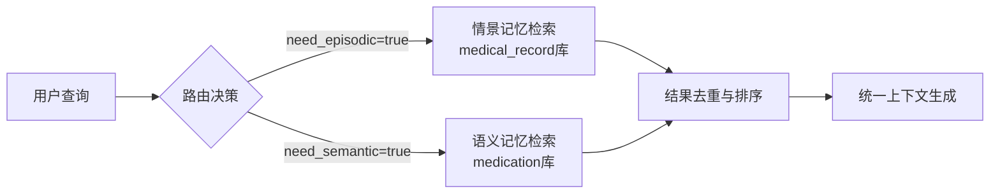

在医疗问答场景中，用户查询可能涉及两类截然不同的知识源：**情景记忆**（个人病历、检查报告等私有数据）和**语义记忆**（药品说明书、医学指南等通用知识）。本系统通过智能路由机制动态识别查询意图，并行检索相应知识库，最终融合结果以提供精准回答。这种双通道设计确保了既保护患者隐私又能利用权威医学知识。

## 检索路由决策机制

系统采用结构化输出的LLM路由器来判断查询类型。当用户提问时，路由模型会分析问题内容并返回两个布尔值：`need_episodic`（是否需要查询个人医疗记录）和`need_semantic`（是否需要查询通用医学知识）。默认情况下，所有查询都会启用语义记忆检索，而情景记忆仅在明确涉及个人健康数据时激活。路由决策基于以下提示词模板：

> 你是医疗检索路由器。请判断以下用户问题需要查询哪些知识源：
> - need_episodic：与用户个人病历、就诊记录、检查报告相关
> - need_semantic：与药品说明书、医学论文、通用医学知识相关
> 若无法判断，默认 need_semantic=true。

该机制确保了即使路由模型失效，系统仍能通过语义记忆提供基础医学知识支持。Sources: [rag_pipeline.py](backend/rag_pipeline.py#L120-L128)

## 双通道并行检索架构

一旦路由决策完成，系统会并行执行两个独立的检索流程：
- **情景记忆通道**：针对用户上传的个人医疗文档（如病历、检查报告），使用`medical_record`知识库类型进行检索
- **语义记忆通道**：针对系统内置的医学知识库（如药品说明书、临床指南），使用`medication`知识库类型进行检索

两个通道均采用相同的三级分块与混合检索策略（稠密向量+BM25），但数据源完全隔离。检索结果通过去重和重排序合并，形成统一上下文供后续生成使用。这种并行设计显著提升了响应速度，同时保持了数据隔离的安全性。Sources: [rag_pipeline.py](backend/rag_pipeline.py#L260-L290)



## 结果呈现与工具集成

检索完成后，系统会分别格式化情景记忆和语义记忆的结果块，并在前端清晰区分展示。工具函数`search_knowledge_base`负责整合两类结果，当任一通道有命中时即返回结构化文本。若两者均无结果，则触发知识图谱查询作为补充。这种分层检索策略确保了回答的全面性：

```
## 情景记忆检索结果
[个人病历相关内容]

## 语义记忆检索结果
[通用医学知识内容]
```

值得注意的是，情景记忆检索严格限定于用户自己的文档，而语义记忆则面向公共医学知识库，这种设计既满足个性化需求又保证了医学准确性。Sources: [tools.py](backend/tools.py#L180-L200)

## 与知识图谱的协同工作

当向量检索无法提供足够信息时（如查询特定疾病属性或关系），系统会自动切换到知识图谱查询模式。意图识别模块（`intent.py`）首先分析用户问题中的医学意图（如"查询疾病病因"），然后`neo4j_queries.py`根据识别出的意图从图谱中提取结构化事实。这种混合检索策略结合了向量检索的灵活性和图谱查询的精确性，特别适合处理复杂的医学关系查询。Sources: [intent.py](backend/intent.py#L1-L111), [neo4j_queries.py](backend/neo4j_queries.py#L1-L318)

## 下一步阅读建议

要深入理解本系统的检索能力，建议继续阅读以下文档：
- [混合检索：稠密向量与 BM25 稀疏向量](12-hun-he-jian-suo-chou-mi-xiang-liang-yu-bm25-xi-shu-xiang-liang)：了解底层检索技术细节
- [三级分块与 Auto-merging 策略](13-san-ji-fen-kuai-yu-auto-merging-ce-lue)：掌握文档分块与合并机制
- [LangGraph Agent 工作流](17-langgraph-agent-gong-zuo-liu)：查看完整Agent执行流程