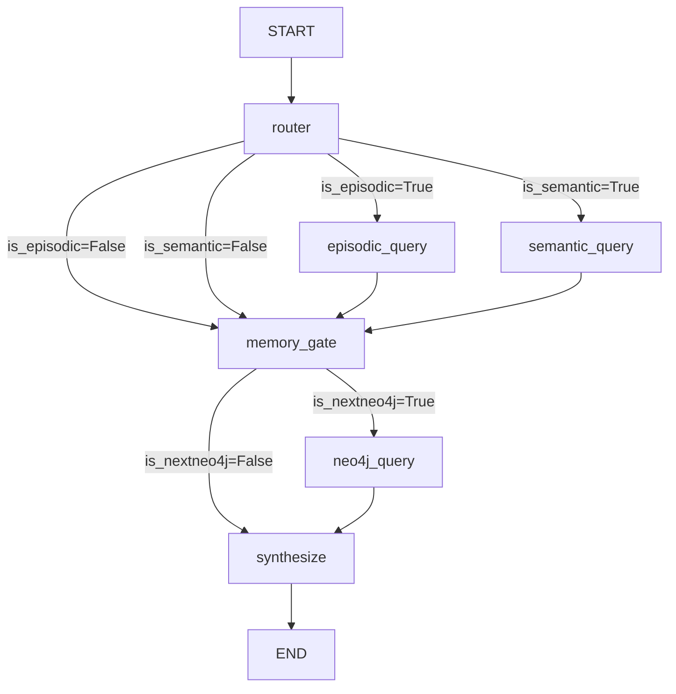

本文档深入解析医疗助手项目中基于 LangGraph 构建的两种核心工作流：**医疗领域专用的检索增强生成（RAG）工作流**和**通用工具调用 Agent 工作流**。这两种工作流共同构成了系统智能决策的核心，前者专注于高效、精准的医疗知识检索与整合，后者则负责处理更广泛的用户请求并协调各种工具。

## 医疗 RAG 工作流：双记忆路由与知识图谱融合

医疗 RAG 工作流是系统处理专业医疗查询的核心引擎，其设计围绕“情景记忆”与“语义记忆”的双轨检索，并可选择性地融合结构化的知识图谱信息。该工作流在 `medical/agent_graph.py` 中定义，采用了一个清晰的线性两阶段拓扑结构。

工作流的起点是 **`router`** 节点，它根据用户的查询意图（由上游模块如 `intent.py` 判定）决定激活哪些检索分支。意图被编码在状态对象 `OverallState` 的 `is_episodic` 和 `is_semantic` 字段中。如果 `is_episodic` 为真，则激活 **`episodic_query`** 分支，用于检索与用户个人健康记录、历史病例等相关的“情景记忆”；如果 `is_semantic` 为真，则激活 **`semantic_query`** 分支，用于检索通用的医学文献、药品说明书等“语义记忆”。这两个分支可以并行执行以提高效率。

无论哪个分支被激活或跳过，它们的结果都会汇聚到 **`memory_gate`** 节点。在此之后，工作流会检查 `is_nextneo4j` 标志。如果为真，则执行 **`neo4j_query`** 节点，从预构建的医疗知识图谱中查询实体间的关系（如疾病-症状、药品-副作用）。最后，所有检索到的上下文（情景、语义、知识图谱）都会传递给 **`synthesize`** 节点，由大语言模型（LLM）进行整合并生成最终的回答。

此设计的关键优势在于其**灵活性**和**可扩展性**。通过简单的布尔标志即可动态调整检索路径，既能处理仅需个人记录的查询，也能处理需要融合多源知识的复杂问题。

Sources: [agent_graph.py](medical/agent_graph.py#L1-L168)

## 通用工具调用 Agent 工作流：流式响应与实时思考可视化

通用工具调用 Agent 工作流位于后端 `backend/agent.py`，它基于 LangChain 的 `create_agent` 构建，负责处理所有用户对话，并能根据需要调用不同的工具，包括上述的医疗 RAG 工具 (`search_knowledge_base`)、知识图谱工具 (`search_knowledge_graph`) 以及天气查询等通用工具。

该工作流的核心在于其实现了**流式响应**和**实时思考链路可视化**。当用户发起请求时，`chat_with_agent_stream` 函数会被调用。它首先加载会话历史，并设置一个全局的异步队列 `_RAG_STEP_QUEUE`。这个队列是实现可视化的核心：在 `search_knowledge_base` 等工具内部，每当执行到 RAG 流程的关键步骤（如文档检索、重排序），就会通过 `emit_rag_step` 函数将一个包含步骤图标、标签和详情的字典推送到这个队列中。

与此同时，一个后台任务 `_agent_worker` 启动，它使用 `agent.astream` 异步流式地获取 LLM 生成的内容块（chunks）。主循环则持续监听统一的输出队列，无论是来自 `emit_rag_step` 的“rag_step”事件，还是来自 `_agent_worker` 的“content”事件，都会被立即包装成 Server-Sent Events (SSE) 推送给前端。这使得用户可以在 LLM 最终回答生成之前，就看到 Agent “思考”的全过程，例如“正在检索相关文档...”、“正在重排序结果...”等，极大地提升了交互的透明度和用户体验。
Sources: [agent.py](backend/agent.py#L201-L432)

## 工作流协同与工具集成

两个工作流并非孤立存在，而是通过工具紧密协同。通用 Agent 工作流中的 `search_knowledge_base` 工具（定义在 `backend/tools.py`）实际上是医疗 RAG 工作流的入口。当 Agent 决定调用此工具时，它会触发 `backend/rag_pipeline.py` 中定义的另一个 LangGraph 工作流（`run_rag_graph`）。

这个嵌套的 RAG 工作流更为复杂，它实现了完整的 RAG 高级策略，包括查询重写（Step-Back, HyDE）、混合检索（稠密向量 + BM25 稀疏向量）、Jina Rerank 精排等。在执行这些步骤时，`emit_rag_step` 被广泛调用，确保了每个内部操作都能实时反馈给用户。

此外，为了保证对话的连贯性和防止工具滥用，系统还实现了严格的**工具调用守卫**。在 `tools.py` 中，`_KNOWLEDGE_TOOL_CALLS_THIS_TURN` 和 `_KG_TOOL_CALLS_THIS_TURN` 计数器确保在单轮对话中，知识库和知识图谱工具各自最多只能被调用一次。每轮对话开始前，`reset_tool_call_guards` 函数会重置这些计数器，从而维护了对话逻辑的清晰和高效。