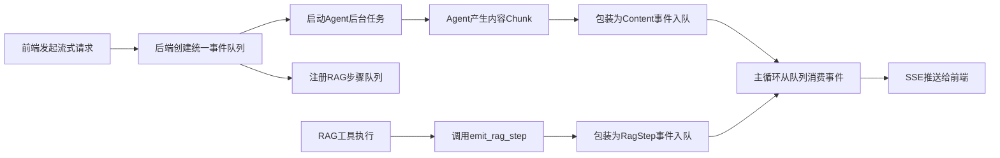

本页面深入解析医疗助手系统中 **实时思考链路展示** 与 **用户中断机制** 的实现原理。该机制通过流式事件推送，在前端动态可视化 Agent 的内部决策过程（如 RAG 检索步骤），并允许用户随时终止冗长的推理过程，从而提升交互体验和系统可控性。

## 架构设计：统一事件队列与跨线程通信

系统的核心在于后端 `chat_with_agent_stream` 函数建立了一个 **统一的异步输出队列**，将两种不同来源的事件——Agent 生成的内容片段（content chunks）和 RAG 工具执行过程中的思考步骤（rag steps）——汇入同一个通道。这解决了传统流式 API 只能返回最终内容而无法暴露中间状态的问题。

具体实现上，当一个流式对话请求开始时，后端会创建一个 `asyncio.Queue` 对象，并通过 `set_rag_step_queue()` 将其注册为全局变量。随后启动两个并发任务：
1.  **Agent 工作任务**：在后台异步运行 LangGraph Agent，监听其产生的 `AIMessageChunk`，并将有效文本内容包装成 `{"type": "content", "content": ...}` 事件推入队列。
2.  **RAG 步骤代理**：RAG 相关工具（如 `search_knowledge_base`）在执行过程中，会调用 `emit_rag_step()` 函数。该函数利用 `call_soon_threadsafe` 方法，将思考步骤（如“正在评估文档相关性...”）安全地推送到主线程的事件队列中，即使工具本身可能运行在同步线程池里。

这种设计确保了无论事件源自异步的 Agent 还是同步的工具函数，都能被有序、安全地传递给前端。

Sources: [agent.py](backend/agent.py#L345-L390)

## RAG 思考步骤的触发与传递

RAG 流水线 (`rag_pipeline.py`) 是思考步骤的主要生产者。在 LangGraph 定义的各个节点（Node）中，关键操作前都会主动调用 `emit_rag_step(icon, label, detail)` 来通知外界当前进展。例如：
-   在文档检索后，会发送 `"🔍", "正在混合检索相关文档..."`。
-   在文档分级节点，会根据结果发送 `"✅", "文档相关性评估通过"` 或 `"⚠️", "文档相关性不足，将重写查询"`。
-   在查询重写节点，会发送 `"✏️", "正在重写查询..."`。

这些调用发生在 `run_rag_graph` 函数内部，而该函数由 `search_knowledge_base` 工具同步调用。`emit_rag_step` 的精妙之处在于它捕获了设置队列时的事件循环 (`_RAG_STEP_LOOP`)，并通过 `call_soon_threadsafe` 确保了即使在同步上下文中也能安全地向异步队列发送消息，避免了线程安全问题。

Sources: [rag_pipeline.py](backend/rag_pipeline.py#L320-L325), [tools.py](backend/tools.py#L65-L75)

## 前端的流式接收与动态渲染

前端 (`script.js`) 通过 `fetch` API 发起一个到 `/chat/stream` 端点的请求，并使用 `AbortController` 来管理请求生命周期。它通过 `response.body.getReader()` 获取流式响应，并按行（以 `\n\n` 分隔）解析服务器发送的 Server-Sent Events (SSE)。

前端为每条消息维护一个状态对象，其中包含 `text`（AI回复内容）、`isThinking`（是否仍在思考）、`ragTrace`（最终的完整RAG追踪信息）和 `ragSteps`（实时的思考步骤数组）。当接收到不同类型的事件时，前端会进行相应处理：
-   **`type: 'content'`**: 将文本追加到当前 AI 消息的 `text` 字段，并结束 `isThinking` 状态。
-   **`type: 'rag_step'`**: 将新的思考步骤对象推入 `ragSteps` 数组，触发 Vue 的响应式更新，从而在 UI 上动态添加一个新的步骤卡片。
-   **`type: 'trace'`**: 保存完整的 RAG 追踪数据，用于后续的详细分析或调试。

Sources: [script.js](frontend/script.js#L240-L280)

## 用户中断机制的实现

中断机制由前端的 `handleStop` 方法和后端的 `AbortController` 协同实现。当用户点击“停止”按钮时：
1.  前端调用 `this.abortController.abort()`，立即中断 `fetch` 请求。
2.  后端的 `chat_with_agent_stream` 函数捕获到 `AbortError` 异常。
3.  后端随即取消正在运行的 Agent 后台任务 (`agent_task.cancel()`)。
4.  前端在 `catch` 块中检测到 `AbortError`，将当前 AI 消息的文本更新为 `(已终止回答)` 或追加 `_(回答已被终止)_`，清晰地告知用户操作结果。

这种设计保证了中断操作的即时性和资源的有效回收。