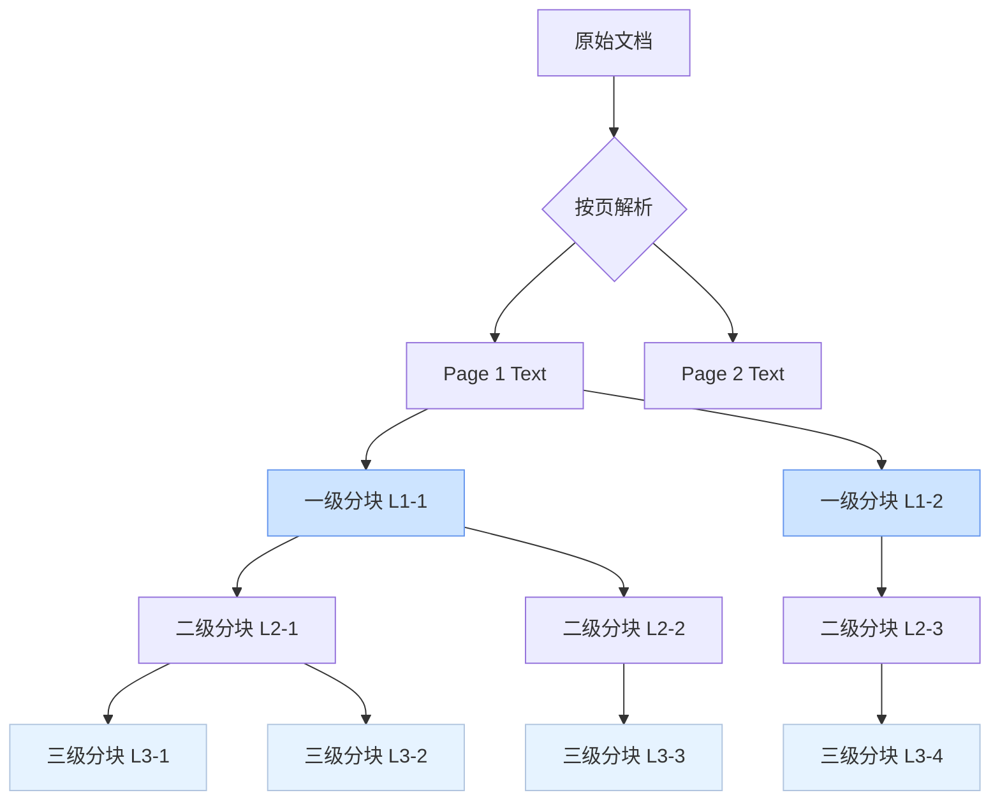

在医疗知识库系统中，文档加载与分块是构建高质量检索增强生成（RAG）能力的基石。本流程采用**三级滑动窗口分块策略**，为后续的混合检索、Auto-merging 和上下文重构提供结构化数据支持。整个过程从原始文件解析开始，经过多级分块，最终将不同粒度的文本片段及其元数据持久化到向量库和关系型数据库中。

## 三级分块架构与实现

文档分块的核心逻辑封装在 `DocumentLoader` 类中，它摒弃了传统的单一粒度分块，转而采用一种自上而下的三层递归分块策略。这种设计旨在平衡检索的精确性与上下文的完整性。

1.  **一级分块 (Level 1)**: 粒度最粗，通常对应一个完整的语义段落或章节（默认约1200字符）。这些分块作为**根分块 (Root Chunk)**，存储在 PostgreSQL 中，用于 Auto-merging Retriever 在检索后重构长上下文。
2.  **二级分块 (Level 2)**: 粒度中等，由一级分块进一步切分而来（默认约600字符）。它们作为一级分块的子节点，同样具备独立的检索价值。
3.  **三级分块 (Level 3)**: 粒度最细，由二级分块再次切分（默认约300字符）。这些小分块被送入 Milvus 向量库进行稠密和稀疏向量化，是混合检索的主要目标。

每个分块都携带丰富的元数据，包括唯一的 `chunk_id`、指向其父分块的 `parent_chunk_id`、指向其根分块的 `root_chunk_id` 以及 `chunk_level` 标识。这种层级关系构成了一个树状结构，为后续的智能合并提供了可能。

Sources: [document_loader.py](backend/document_loader.py#L8-L137)

## 文档加载与处理流水线

文档从上传到入库的完整流水线由多个服务协同完成，并通过 `UploadJobManager` 进行状态跟踪。该流水线主要包含以下关键步骤：

| 步骤 | 负责模块 | 主要任务 | 输出/存储位置 |
| :--- | :--- | :--- | :--- |
| **解析与分块** | `DocumentLoader` | 加载PDF/Word/Excel文件，执行三级分块 | 内存中的分块列表 |
| **父级分块入库** | `ParentChunkStore` | 将一级和二级分块写入 PostgreSQL，并缓存至 Redis | `parent_chunks` 表 + Redis |
| **向量化入库** | `MilvusWriter` + `EmbeddingService` | 为三级分块生成稠密（Jina）和稀疏（BM25）向量，并写入 Milvus | Milvus 集合 |

当用户上传一个文件时，系统首先调用 `DocumentLoader.load_document` 方法。该方法根据文件类型选择合适的加载器（如 `PyPDFLoader`），将文档按页解析，并对每一页的内容递归地应用三级分块逻辑。分块完成后，生成的文档列表会分别送入 `ParentChunkStore` 和 `MilvusWriter` 进行持久化。`ParentChunkStore` 负责存储所有层级的分块元数据，而 `MilvusWriter` 则专注于为最细粒度的三级分块生成并存储向量。

Sources: [document_loader.py](backend/document_loader.py#L139-L187), [parent_chunk_store.py](backend/parent_chunk_store.py#L35-L68), [milvus_writer.py](backend/milvus_writer.py#L13-L64)

## 分块元数据与存储策略

每个分块对象都是一个包含丰富信息的字典，其核心字段定义了分块在整个系统中的身份和关系。下表详细说明了这些关键元数据字段：

| 字段名 | 描述 | 示例 | 存储位置 |
| :--- | :--- | :--- | :--- |
| `chunk_id` | 分块的全局唯一ID，编码了知识库类型、文件名、页码、层级和序号 | `medical_record::report.pdf::p0::l3::5` | Milvus, PostgreSQL |
| `parent_chunk_id` | 指向直接父分块的ID。一级分块此项为空 | `medical_record::report.pdf::p0::l2::2` | Milvus, PostgreSQL |
| `root_chunk_id` | 指向其所属一级（根）分块的ID | `medical_record::report.pdf::p0::l1::0` | Milvus, PostgreSQL |
| `chunk_level` | 分块的层级（1, 2, 或 3） | `3` | Milvus, PostgreSQL |
| `chunk_idx` | 文档内全局递增的分块索引，用于排序 | `42` | Milvus, PostgreSQL |
| `kb_type` | 知识库类型，用于隔离不同领域的数据 | `medical_record`, `medication` | PostgreSQL, Milvus |

这种精心设计的元数据结构使得系统能够在检索阶段灵活地操作分块。例如，Auto-merging Retriever 可以利用 `root_chunk_id` 快速聚合来自同一语义段落的所有相关分块，从而向大模型提供更连贯、信息更完整的上下文。