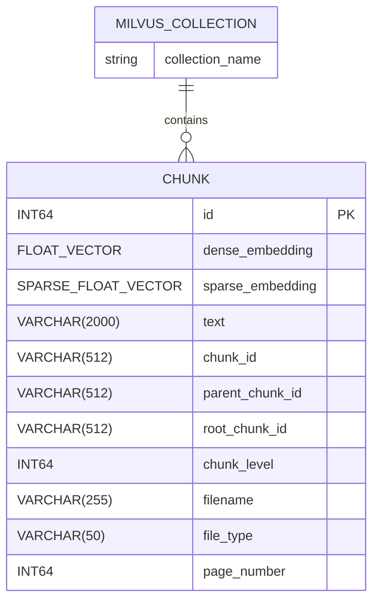

本文档深入解析 Medical-Assistant 项目中 Milvus 向量库的存储策略，涵盖其双知识库隔离设计、混合向量（稠密+稀疏）存储结构、以及与 BM25 统计信息的协同机制。该策略是实现高效、精准医疗领域检索的核心基础。

## 双知识库隔离架构

系统采用**双知识库隔离**策略，将医疗记录（`medical_record`）和药品信息（`medication`）分别存储在 Milvus 的两个独立集合（Collection）中。这种设计基于以下考量：
1.  **数据特性差异**：医疗记录通常为非结构化文本（如病历、报告），而药品信息则更偏向于结构化或半结构化数据（如药品说明书）。两者在语义分布、关键词汇和查询模式上存在显著不同。
2.  **检索精度优化**：隔离存储允许为每类数据独立维护其 BM25 稀疏向量的词表（Vocabulary）和文档频率（Document Frequency, DF）统计信息，从而在计算稀疏向量时获得更高的相关性。
3.  **管理与扩展性**：便于独立进行数据更新、删除和索引重建等操作，降低了系统耦合度，提升了可维护性。

集合名称通过环境变量 `MILVUS_COLLECTION_MEDICAL_RECORD` 和 `MILVUS_COLLECTION_MEDICATION` 配置，默认值分别为 `medical_record_collection` 和 `medication_collection`。Sources: [milvus_client.py](backend/milvus_client.py#L18-L25)

## 混合向量存储结构

Milvus 集合的 Schema 被精心设计以支持**稠密向量与稀疏向量的混合检索**。每个分块（Chunk）在插入时都会同时生成并存储两种向量，以及其他用于上下文构建和溯源的关键元数据。

下表详细列出了集合中的核心字段及其用途：

| 字段名 | 数据类型 | 描述 |
| :--- | :--- | :--- |
| `id` | INT64 | Milvus 自动生成的主键。 |
| `dense_embedding` | FLOAT_VECTOR | 稠密向量，由 `BAAI/bge-m3` 模型生成，维度默认为1024。 |
| `sparse_embedding` | SPARSE_FLOAT_VECTOR | 稀疏向量，基于增量式 BM25 算法计算得出。 |
| `text` | VARCHAR(2000) | 分块的原始文本内容。 |
| `chunk_id` | VARCHAR(512) | 分块的唯一标识符。 |
| `parent_chunk_id` | VARCHAR(512) | 父级分块的 ID，用于实现 Auto-merging 策略。 |
| `root_chunk_id` | VARCHAR(512) | 根分块的 ID，指向文档的最顶层分块。 |
| `chunk_level` | INT64 | 分块层级（0为根分块，数值越大层级越深）。 |
| `filename` / `file_type` / `page_number` | VARCHAR / VARCHAR / INT64 | 文件元数据，用于结果展示和溯源。 |

此外，系统为 `dense_embedding` 字段配置了 `HNSW` 索引，为 `sparse_embedding` 字段配置了 `SPARSE_INVERTED_INDEX` 索引，以加速各自的近似最近邻（ANN）搜索。Sources: [milvus_client.py](backend/milvus_client.py#L67-L95)

## BM25 统计信息的持久化与同步

稀疏向量的计算依赖于经典的 BM25 算法，其核心是全局的词表和文档频率（DF）统计。为了确保检索的一致性和准确性，系统实现了**增量式、持久化的 BM25 状态管理**。

`EmbeddingService` 类负责管理这一状态。它为 `medical_record` 和 `medication` 两个知识库分别维护独立的状态文件（`bm25_state_medical_record.json` 和 `bm25_state_medication.json`），存储在项目的 `data/` 目录下。每当有新文档被处理（`increment_add_documents`）或旧文档被删除（`increment_remove_documents`）时，服务会实时更新内存中的统计信息，并立即将其持久化到对应的 JSON 文件中。

这种设计保证了：
-   **一致性**：Milvus 中存储的稀疏向量与用于新查询计算的稀疏向量基于完全相同的统计背景。
-   **增量性**：无需在每次重启时重新扫描所有数据来构建词表，极大提升了系统启动和数据更新的效率。
-   **隔离性**：两个知识库的词表互不影响，各自保持最优的检索效果。

Sources: [embedding.py](backend/embedding.py#L178-L234), [milvus_writer.py](backend/milvus_writer.py#L20-L23)

## 数据写入与检索流程

数据的写入和检索是该存储策略的两个关键操作，均由 `MilvusManager` 和 `MilvusWriter` 协同完成。

**写入流程 (`write_documents`)**:
1.  根据 `kb_type` 初始化对应集合（如果不存在）。
2.  调用 `EmbeddingService` 的 `increment_add_documents` 方法，将新文档文本加入 BM25 统计。
3.  批量获取文本的稠密和稀疏向量。
4.  将包含向量和元数据的完整记录插入 Milvus。

**检索流程 (`hybrid_retrieve`)**:
1.  接收用户的查询文本。
2.  使用对应 `kb_type` 的 `EmbeddingService` 实时计算查询的稠密和稀疏向量。
3.  在指定的 Milvus 集合上并行发起稠密和稀疏向量的 ANN 搜索请求。
4.  使用 RRF (Reciprocal Rank Fusion) 算法融合两路结果，返回最终排序的分块列表。

此流程确保了从数据摄入到查询响应的全链路一致性，并充分利用了混合检索的优势。Sources: [milvus_writer.py](backend/milvus_writer.py#L14-L64), [milvus_client.py](backend/milvus_client.py#L264-L322)