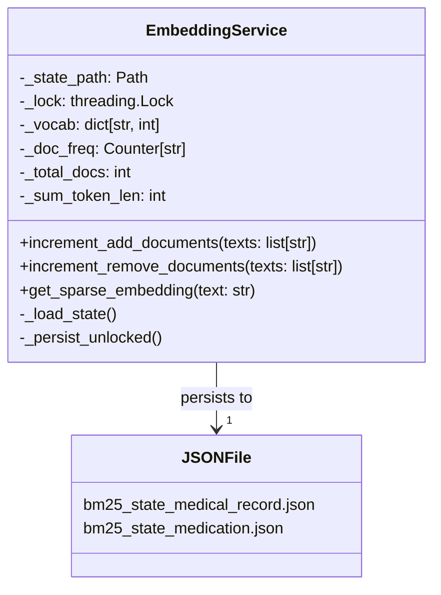

在混合检索系统中，BM25 算法依赖于全局的词频（df）和文档总数（N）等统计信息。本页面详细阐述了这些关键统计信息如何在 Medical-Assistant 项目中实现持久化存储、增量更新以及与向量库操作的精确同步，确保检索结果的准确性和一致性。

## 核心架构：EmbeddingService 的持久化设计

BM25 统计信息的核心载体是 `EmbeddingService` 类，它不仅负责生成稠密和稀疏向量，还承担了统计状态的管理职责。该服务将词表（vocab）、文档频率（doc_freq）、文档总数（total_docs）和总词数（sum_token_len）等关键数据序列化到 JSON 文件中，并通过文件锁机制保证多线程环境下的写入安全。系统为不同知识库（病历和药品）维护独立的状态文件，避免数据污染。

服务初始化时会尝试从指定路径加载现有状态，若文件不存在或版本不匹配则从零开始。任何导致词表变更的操作（如遇到新词）都会触发即时持久化，确保状态不会因意外中断而丢失。Sources: [embedding.py](backend/embedding.py#L38-L234)

## 增量同步：与文档生命周期的绑定

BM25 统计信息的更新严格绑定到文档的增删生命周期，这是保证检索准确性的重要机制。当新文档通过 `MilvusWriter.write_documents` 流程入库时，其所有文本块会被传递给 `increment_add_documents` 方法，从而原子性地更新全局统计。反之，在删除文档时，API 层会先从 Milvus 中查询出该文档的所有文本内容，再调用 `increment_remove_documents` 进行对称的统计移除。

这种设计确保了 BM25 的语料库视图始终与向量库中的实际文档集合保持一致。值得注意的是，删除操作不会回收词表索引，以防止与 Milvus 中可能尚未清理的旧稀疏向量发生维度错位。Sources: [milvus_writer.py](backend/milvus_writer.py#L32), [api.py](backend/api.py#L70)

## 存储位置与多知识库隔离

所有的 BM25 状态文件均存储在项目根目录下的 `data/` 文件夹中。系统明确区分了两种知识库类型：`medical_record`（病历）和 `medication`（药品），并分别为它们创建了独立的 `EmbeddingService` 实例和对应的状态文件（`bm25_state_medical_record.json` 和 `bm25_state_medication.json`）。这种隔离策略使得两个领域的检索可以拥有各自独立的词频统计，极大提升了领域内检索的相关性。

| 知识库类型 | 状态文件路径 | 对应服务实例 |
| :--- | :--- | :--- |
| **medical_record** | `data/bm25_state_medical_record.json` | `embedding_service_medical_record` |
| **medication** | `data/bm25_state_medication.json` | `embedding_service_medication` |

这种物理隔离的设计，使得系统能够针对不同领域的语言特性进行更精准的 BM25 计算。Sources: [embedding.py](backend/embedding.py#L218-L229), [run_bash](command#L1)

## 下一步阅读建议

理解了 BM25 统计信息的持久化机制后，您可以继续深入探索其在检索流程中的具体应用：
- 混合检索的完整工作流，请参阅 [混合检索：稠密向量与 BM25 稀疏向量](12-hun-he-jian-suo-chou-mi-xiang-liang-yu-bm25-xi-shu-xiang-liang)
- 文档从上传到入库的完整处理链条，请参阅 [文档加载与分块处理流程](20-wen-dang-jia-zai-yu-fen-kuai-chu-li-liu-cheng)
- 向量数据在 Milvus 中的具体存储策略，请参阅 [Milvus 向量库存储策略](21-milvus-xiang-liang-ku-cun-chu-ce-lue)