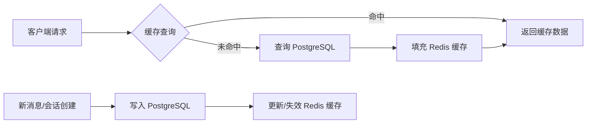

本页面详细阐述了医疗助理系统中用户会话历史的**双重存储策略**：通过 **PostgreSQL 进行持久化**确保数据可靠性，同时利用 **Redis 缓存**提升高频读取性能。这种架构设计在保证数据完整性的前提下，显著优化了对话加载和会话列表查询的响应速度。

## 架构概览：持久化与缓存协同

系统的会话管理采用分层存储架构。所有会话元数据和消息内容首先持久化到 PostgreSQL 数据库，形成可靠的数据源；同时，在关键读写操作时同步更新 Redis 缓存，为后续请求提供低延迟访问。当缓存失效或未命中时，系统会自动回退到数据库查询，并重新填充缓存。

Sources: [agent.py](backend/agent.py#L50-L200)

## 数据模型：PostgreSQL 持久化结构

会话数据在 PostgreSQL 中通过三个核心表进行建模，构成完整的关联关系：
- **`users`**: 存储用户基本信息。
- **`chat_sessions`**: 存储会话元数据，包括 `session_id`、`user_id`（外键）和 `metadata_json`（用于存储会话上下文摘要等扩展信息）。
- **`chat_messages`**: 存储每条消息的详细内容，通过 `session_ref_id`（外键）关联到 `chat_sessions` 表。每条消息记录包含 `message_type`（human/ai/system）、`content`、`timestamp` 以及可选的 `rag_trace`（用于存储 RAG 检索过程的调试信息）。

这种设计确保了会话数据的强一致性，并支持高效的级联删除（当用户或会话被删除时，相关消息自动清理）。

Sources: [models.py](backend/models.py#L1-L64)

## 缓存策略：Redis 高性能读取

系统通过 `RedisCache` 工具类封装了与 Redis 的交互，并定义了两种核心缓存键：
1.  **会话消息缓存**: 键格式为 `supermew:chat_messages:{user_id}:{session_id}`，值为该会话所有消息的 JSON 序列化数组。
2.  **用户会话列表缓存**: 键格式为 `supermew:chat_sessions:{user_id}`，值为该用户所有会话的摘要信息（`session_id`, `updated_at`, `message_count`）JSON 数组。

缓存具有默认的 TTL（Time-To-Live，默认300秒），并在以下场景被主动管理：
- **写入时更新**: 保存新消息后，立即用最新数据覆盖对应会话的消息缓存，并删除用户的会话列表缓存以强制下次查询时刷新。
- **删除时失效**: 删除会话时，同时清除该会话的消息缓存和用户的会话列表缓存。
- **读取时填充**: 当请求的数据在缓存中不存在时，从数据库加载后立即写入缓存。

Sources: [cache.py](backend/cache.py#L1-L56), [agent.py](backend/agent.py#L54-L210)

## 核心操作流程

### 保存会话 (`save`)
1.  在 `chat_sessions` 表中创建或更新会话记录。
2.  删除该会话在 `chat_messages` 表中的所有旧消息。
3.  将新的消息列表批量插入 `chat_messages` 表。
4.  **同步操作**: 将序列化后的消息列表写入 Redis 的会话消息缓存键，并删除用户的会话列表缓存键。

### 加载会话 (`load`)
1.  首先尝试从 Redis 的会话消息缓存键读取数据。
2.  若缓存命中，直接反序列化并转换为 LangChain 消息对象返回。
3.  若缓存未命中，则查询 PostgreSQL 的 `chat_messages` 表，获取消息后，先填充 Redis 缓存，再转换返回。

### 列出会话 (`list_session_infos`)
1.  首先尝试从 Redis 的用户会话列表缓存键读取数据。
2.  若缓存命中，直接返回。
3.  若缓存未命中，则查询 PostgreSQL 的 `chat_sessions` 表，并为每个会话统计消息数量，组合成摘要列表后，填充 Redis 缓存并返回。

Sources: [agent.py](backend/agent.py#L57-L199)

## API 与存储层集成

FastAPI 后端通过 `ConversationStorage` 类（在 `agent.py` 中定义，并在 `api.py` 中以 `storage` 实例导入）统一处理所有会话相关的数据操作。前端发起的 `/sessions` 相关 API 请求（如获取会话列表、获取会话消息、删除会话）均由 `api.py` 路由到 `storage` 的相应方法，从而无缝集成上述持久化与缓存逻辑。

Sources: [api.py](backend/api.py#L107-L138), [agent.py](backend/agent.py#L27)

## 下一步阅读建议

理解了会话历史的存储机制后，您可以继续深入探索会话内容如何被提炼和利用：
- 了解系统如何生成**会话摘要**以节省上下文窗口并注入长期记忆，请阅读 [会话摘要与上下文注入](25-hui-hua-zhai-yao-yu-shang-xia-wen-zhu-ru)。
- 了解支撑整个系统运行的底层**数据库与缓存设计**细节，请回顾 [数据库与缓存设计 (PostgreSQL + Redis)](11-shu-ju-ku-yu-huan-cun-she-ji-postgresql-redis)。