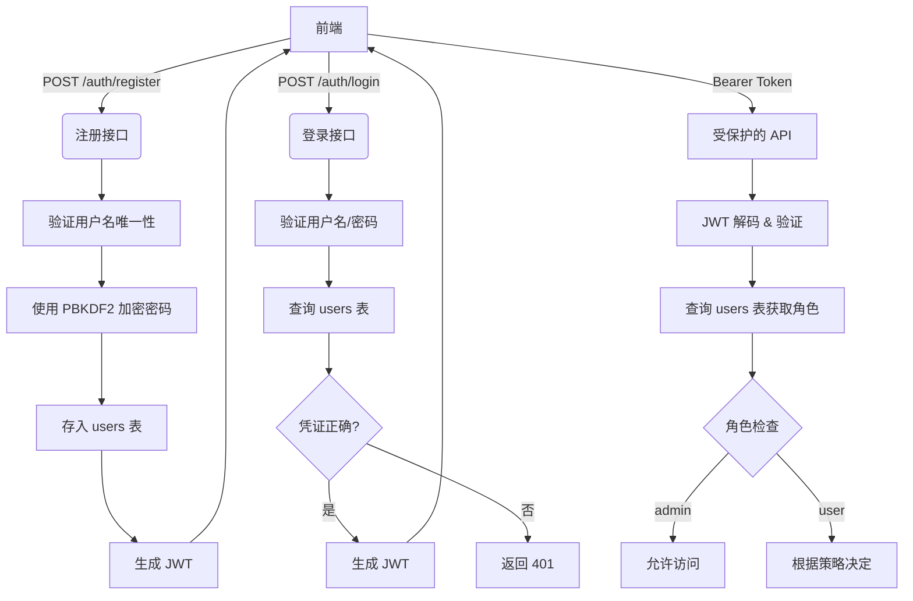

本页面详细阐述了 Medical-Assistant 项目的用户认证与授权机制。系统存在两套独立的用户管理体系：一套基于 **FastAPI + SQLAlchemy** 的后端 API 认证系统，用于支持现代化的 Web 前端；另一套基于 **Streamlit + JSON 文件** 的简易认证系统，用于快速原型验证。本文将分别解析这两套机制，并明确其适用场景。

## 后端 API 认证体系 (FastAPI)

这是项目推荐的、功能完整的认证方案，采用 JWT (JSON Web Token) 进行无状态认证，并通过 PostgreSQL 数据库存储用户凭证和角色信息。

### 核心架构与流程

整个认证流程遵循标准的 OAuth2 密码模式，其核心组件和数据流如下：

Sources: [auth.py](backend/auth.py), [api.py](backend/api.py#L75-L98), [models.py](backend/models.py#L6-L15)

### 关键安全特性

后端认证系统实现了多项安全最佳实践：

| 特性 | 实现细节 | 安全价值 |
| :--- | :--- | :--- |
| **密码哈希** | 使用 `PBKDF2-HMAC-SHA256` 算法，迭代轮数可通过 `PASSWORD_PBKDF2_ROUNDS` 环境变量配置（默认 310,000 轮） | 抵御彩虹表攻击和暴力破解 |
| **令牌安全** | JWT 使用 HS256 算法签名，密钥通过 `JWT_SECRET_KEY` 环境变量配置，有效期可通过 `JWT_EXPIRE_MINUTES` 设置（默认 24 小时） | 保证令牌完整性和时效性 |
| **角色管理** | 用户角色 (`role`) 存储在数据库中，`admin` 角色需要有效的邀请码 (`ADMIN_INVITE_CODE`) 才能注册 | 实现最小权限原则 |
| **依赖注入** | 通过 FastAPI 的 `Depends` 机制，自动处理数据库会话和当前用户解析 | 减少样板代码，提高安全性 |

Sources: [auth.py](backend/auth.py#L1-L35), [auth.py](backend/auth.py#L37-L63)

### 注册与登录 API

系统提供了清晰的 RESTful API 接口用于用户管理：

**1. 用户注册 (`POST /auth/register`)**
- **请求体**: `RegisterRequest` (包含 `username`, `password`, 可选的 `role` 和 `admin_code`)
- **逻辑**: 
  - 验证用户名和密码非空。
  - 检查用户名是否已存在。
  - 若请求 `admin` 角色，需提供正确的 `ADMIN_INVITE_CODE`。
  - 对密码进行 PBKDF2 哈希处理。
  - 在 `users` 表中创建新记录。
  - 返回包含 JWT 的 `AuthResponse`。

**2. 用户登录 (`POST /auth/login`)**
- **请求体**: `LoginRequest` (包含 `username`, `password`)
- **逻辑**: 
  - 查询数据库中的用户记录。
  - 使用 `verify_password` 函数验证明文密码与哈希值。
  - 验证成功后，生成并返回 JWT。

Sources: [api.py](backend/api.py#L75-L98), [schemas.py](backend/schemas.py#L4-L18)

## Streamlit 原型认证体系

位于 `medical/` 目录下的 Streamlit 应用 (`webui.py`) 使用了一套独立的、基于文件的简易认证系统。这套系统主要用于快速演示和本地开发，**不应用于生产环境**。

### 工作原理

该系统的核心逻辑非常直接：
1. **存储**: 用户凭证（用户名、明文密码、管理员标志）以 JSON 格式存储在 `tmp_data/user_credentials.json` 文件中。
2. **初始化**: 如果凭证文件不存在或为空，系统会自动创建一个默认的管理员账户 (`admin`/`admin123`)。
3. **认证**: 登录时，直接从内存中的 `credentials` 字典读取并比对明文密码。
4. **会话**: 使用 Streamlit 的 `st.session_state` 来管理用户的登录状态和角色。

Sources: [user_data_storage.py](medical/user_data_storage.py), [login.py](medical/login.py)

### 与后端 API 的关系

这两套系统**完全独立，互不影响**。`medical/login.py` 和 `medical/webui.py` 构成了一个自包含的 Streamlit 应用，它不调用后端 `backend/` 目录下的任何 API。而 `frontend/` 目录下的 HTML/JS 应用则设计为与 `backend/` 的 FastAPI 服务进行交互。

对于开发者而言，应明确区分：
- **开发/演示用途**: 使用 `streamlit run medical/webui.py` 启动的 Streamlit 应用及其内置认证。
- **生产/集成用途**: 使用 `uvicorn main:app` 启动的 FastAPI 后端，并配合 `frontend/` 或其他现代前端框架进行开发。

Sources: [login.py](medical/login.py#L47-L58)

## 总结与下一步

本项目提供了两种用户认证路径以适应不同场景。对于构建正式应用，应聚焦于 **后端 API 认证体系**，它具备完善的安全措施和可扩展性。

完成用户认证后，下一步通常是管理个人的知识库。请继续阅读：[文档上传与知识库管理](7-wen-dang-shang-chuan-yu-zhi-shi-ku-guan-li)。