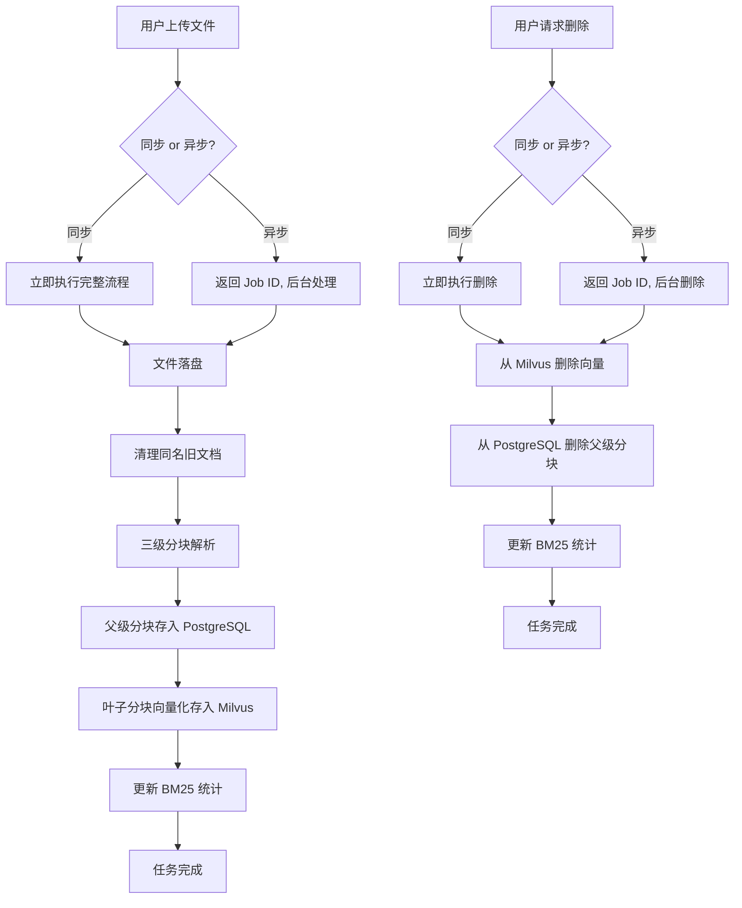

本文档详细介绍了 Medical-Assistant 系统中**文档上传**与**知识库管理**的核心流程。作为 RAG（检索增强生成）系统的基础，该功能允许用户将医疗记录（`medical_record`）或药品说明书（`medication`）等专业文档上传至系统，并自动完成解析、分块、向量化及存储，最终构建可供智能对话使用的动态知识库。本指南将帮助开发者理解其架构设计、API 使用及后台处理逻辑。

## 整体架构与数据流

文档上传与知识库管理是一个典型的异步任务处理流程，涉及文件系统、向量数据库（Milvus）和关系型数据库（PostgreSQL）的协同工作。其核心目标是将原始文档转化为结构化的、可高效检索的知识单元。

整个流程可分为两大阶段：**上传/入库**和**删除/清理**。系统通过一个轻量级的任务管理器来跟踪每个操作的进度，并为前端提供实时状态更新。

Sources: [upload_jobs.py](backend/upload_jobs.py#L1-L178), [api.py](backend/api.py#L200-L544)

## 核心组件解析

### 1. 上传任务管理器 (`UploadJobManager`)

位于 `upload_jobs.py` 的 `UploadJobManager` 是整个流程的状态中枢。它是一个线程安全的内存字典，用于追踪每个上传或删除任务的详细状态。

- **任务创建**：当用户发起上传或删除请求时，系统会创建一个包含多个步骤（如 `upload`, `parse`, `vector_store`）的任务对象。
- **状态更新**：后台任务在执行每个步骤时，会调用 `update_step` 方法来更新进度百分比、状态（`pending`/`running`/`completed`/`failed`）和消息。
- **任务查询**：前端可以通过 `/documents/upload/jobs/{job_id}` 或 `/documents/delete/jobs/{job_id}` API 实时查询任务状态，实现进度条或状态卡片的动态刷新。

该设计目前使用进程内内存存储，适用于单机开发和部署。注释中明确指出，未来若需支持多进程或服务重启后恢复任务，可将其迁移至 Redis 或 PostgreSQL。

Sources: [upload_jobs.py](backend/upload_jobs.py#L35-L176)

### 2. 文档加载与三级分块 (`DocumentLoader`)

`document_loader.py` 中的 `DocumentLoader` 负责将原始文件（PDF, Word, Excel）解析为文本，并执行关键的**三级分块**策略。

- **分块逻辑**：系统采用递归分块方式，将文档内容分为三个层级：
  - **Level 1 (Root)**: 大块（约1200字符），代表文档的主要章节。
  - **Level 2 (Parent)**: 中块（约600字符），是 Level 1 的子集。
  - **Level 3 (Leaf)**: 小块（约300字符），是最终用于向量化和检索的单元。
- **父子关系**：每个 Level 3 的叶子分块都通过 `parent_chunk_id` 和 `root_chunk_id` 字段关联到其父级和根级分块。这种设计支持后续的 **Auto-merging** 策略，即在检索到相关叶子分块后，可以回溯并合并其上下文以提供更完整的答案。

此过程确保了知识库既能进行细粒度的精确检索，又能保证回答的上下文连贯性。

Sources: [document_loader.py](backend/document_loader.py#L1-L187)

### 3. 数据存储层

处理后的分块数据会根据其层级被写入不同的存储系统：
- **父级分块 (Level 1 & 2)**：通过 `ParentChunkStore` 类存入 **PostgreSQL** 数据库。这些分块不参与向量检索，但为答案合成提供必要的上下文。
- **叶子分块 (Level 3)**：通过 `MilvusWriter` 类进行向量化，并存入 **Milvus** 向量数据库。同时，其文本内容会被用于更新 **BM25** 稀疏检索的统计信息（持久化在 `data/bm25_state_*.json` 文件中），以支持混合检索。

Sources: [api.py](backend/api.py#L260-L290), [data directory](data)

## API 接口概览

系统提供了同步和异步两套 API 来满足不同场景的需求。

| **操作** | **API 端点** | **方法** | **类型** | **描述** |
| :--- | :--- | :--- | :--- | :--- |
| **上传文档** | `/documents/upload` | `POST` | 同步 | 上传文件并阻塞等待处理完成。适用于小文件或调试。 |
| **异步上传** | `/documents/upload/async` | `POST` | 异步 | 上传文件后立即返回 `job_id`，后台处理。适用于大文件，避免请求超时。 |
| **查询上传任务** | `/documents/upload/jobs/{job_id}` | `GET` | - | 根据 `job_id` 查询异步上传任务的当前状态。 |
| **列出所有上传任务** | `/documents/upload/jobs` | `GET` | - | 获取当前所有上传任务的列表。 |
| **删除文档** | `/documents/{filename}` | `DELETE` | 同步 | 立即删除指定文件的所有向量和元数据。 |
| **异步删除** | `/documents/delete/async/{filename}` | `DELETE` | 异步 | 提交删除任务并立即返回 `job_id`，后台执行清理。 |
| **查询删除任务** | `/documents/delete/jobs/{job_id}` | `GET` | - | 根据 `job_id` 查询异步删除任务的当前状态。 |
| **列出文档** | `/documents` | `GET` | - | 获取指定知识库类型（`kb_type`）下所有已上传的文档列表及其分块数量。 |

所有 API 均要求用户登录，并通过 `kb_type` 参数区分 `medical_record` 和 `medication` 两种知识库类型。

Sources: [api.py](backend/api.py#L390-L544)

## 下一步学习建议

理解了文档上传与知识库管理的基础后，您可以深入探索以下相关主题，以获得对系统更全面的认识：
- 文档的**三级分块**具体是如何实现的，以及它如何服务于后续的检索？请阅读 `[三级分块与 Auto-merging 策略](13-san-ji-fen-kuai-yu-auto-merging-ce-lue)`。
- 向量化后的数据是如何在 **Milvus** 中进行存储和管理的？请查阅 `[Milvus 向量库存储策略](21-milvus-xiang-liang-ku-cun-chu-ce-lue)`。
- **BM25** 统计信息是如何被持久化并与向量检索协同工作的？详情见 `[BM25 统计信息的持久化与同步](23-bm25-tong-ji-xin-xi-de-chi-jiu-hua-yu-tong-bu)`。
- 整个后端服务是如何组织和启动的？请参考 `[后端整体架构 (FastAPI + LangGraph)](9-hou-duan-zheng-ti-jia-gou-fastapi-langgraph)`。