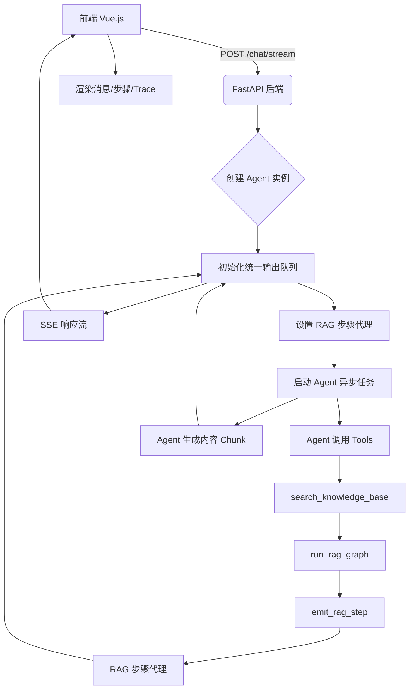

本页面详细解析了 Medical-Assistant 项目中流式对话（Streaming Chat）与实时 RAG（Retrieval-Augmented Generation）可视化功能的实现机制。该功能允许用户在与 AI 助手交互时，实时看到模型生成的文本以及后台检索增强过程中的关键步骤，极大地提升了用户体验和系统透明度。

## 架构概览

整个功能的核心在于前后端协同工作：后端通过异步生成器（Async Generator）将模型输出和 RAG 步骤事件以 Server-Sent Events (SSE) 格式推送；前端则通过 `fetch` API 和 `AbortController` 接收并渲染这些事件，同时支持用户中断请求。RAG 检索步骤的实时性是通过一个全局队列和线程安全调度机制实现的，确保即使在工具同步执行期间也能即时反馈。

Sources: [api.py](backend/api.py#L150-L174), [agent.py](backend/agent.py#L280-L398), [tools.py](backend/tools.py#L50-L70)

## 后端流式处理机制

后端的 `/chat/stream` 端点是流式对话的入口。它不返回一个完整的 JSON 响应，而是返回一个 `StreamingResponse`，其内容由一个异步生成器 `event_generator` 动态产生。这个生成器内部启动了一个后台任务 `_agent_worker` 来运行 LangChain Agent，并监听一个统一的 `output_queue`。

关键创新点在于 **统一输出队列** 的设计。无论是 Agent 生成的文本内容 (`content`)，还是 RAG 工具执行过程中发出的检索步骤 (`rag_step`)，都会被放入同一个队列。这解决了传统流式实现中 RAG 步骤必须等待工具完全执行完毕才能显示的问题。

当 Agent 调用 `search_knowledge_base` 工具时，该工具会执行 `run_rag_graph`。在此过程中，每当有关键步骤（如路由决策、分块检索、Auto-merging 合并），就会调用 `emit_rag_step` 函数。`emit_rag_step` 利用 `call_soon_threadsafe` 方法，将步骤信息安全地推送到主线程的 `output_queue` 中，从而实现了跨线程的实时事件推送。

Sources: [agent.py](backend/agent.py#L280-L398), [tools.py](backend/tools.py#L50-L70), [rag_pipeline.py](backend/rag_pipeline.py#L179-L225)

## 前端事件接收与渲染

前端使用 Vue.js 构建，通过 `fetch` API 向 `/chat/stream` 发起请求，并传入一个 `AbortController` 的信号以支持取消操作。接收到响应流后，前端代码会持续读取并解析 SSE 数据。

每个 SSE 事件都是一个 JSON 对象，包含一个 `type` 字段来区分不同类型的数据：
- `content`: 包含模型正在生成的文本片段。
- `rag_step`: 包含一个 RAG 检索步骤，带有 `icon`, `label`, 和 `detail` 字段，用于在界面上展示一个可视化的步骤卡片。
- `trace`: 包含最终的 RAG 追踪信息 (`rag_trace`)，通常在流结束时发送，用于展示最终使用的上下文来源。
- `error`: 包含错误信息。

前端将这些事件动态地应用到当前的消息对象上。例如，`rag_step` 会被推入 `messages[botMsgIdx].ragSteps` 数组，然后在模板中通过 `v-for` 循环渲染出来，形成一个逐步展开的 RAG 过程可视化面板。

Sources: [script.js](frontend/script.js#L260-L310), [index.html](frontend/index.html#L380-L420)

## RAG 可视化步骤详解

RAG 可视化通过一系列精心设计的步骤图标和标签，向用户清晰地展示了检索增强的全过程。这些步骤由 `rag_pipeline.py` 中的 `_emit_retrieve_path_steps` 和 `route_and_build_queries_node` 等函数触发。

下表总结了主要的 RAG 可视化步骤及其含义：

| 图标 | 标签前缀 | 步骤描述 | 触发时机 |
| :--- | :--- | :--- | :--- |
| 🧭 | 路由识别完成 | 显示是否需要情景记忆或语义记忆检索 | 查询路由决策后 |
| 📝 | [情景记忆] 查询语句 | 展示用于情景记忆库的查询 | 路由后，准备检索前 |
| 🔍 | [语义记忆] 查询语句 | 展示用于语义记忆库的查询 | 路由后，准备检索前 |
| 🧱 | 三级分块检索 | 显示叶子层召回的候选数量 | 叶子层向量检索完成后 |
| 🧩 | Auto-merging 合并 | 显示合并是否启用、应用及替换片段数 | Auto-merging 算法执行后 |
| ✅ | 检索完成 | 显示最终找到的片段数量和检索模式 | 整个检索流程结束时 |

这种细粒度的反馈让用户能够直观地理解 AI 助手是如何从知识库中寻找答案的，增强了系统的可信度和可解释性。

Sources: [rag_pipeline.py](backend/rag_pipeline.py#L175-L225)

## 下一步阅读建议

要更深入地理解支撑此功能的底层技术，请继续阅读以下页面：
- 了解后端整体架构如何组织，请阅读 [后端整体架构 (FastAPI + LangGraph)](9-hou-duan-zheng-ti-jia-gou-fastapi-langgraph)
- 想知道 RAG 检索的具体策略（如混合检索、三级分块），请阅读 [混合检索：稠密向量与 BM25 稀疏向量](12-hun-he-jian-suo-chou-mi-xiang-liang-yu-bm25-xi-shu-xiang-liang) 和 [三级分块与 Auto-merging 策略](13-san-ji-fen-kuai-yu-auto-merging-ce-lue)
- 对前端如何管理会话历史感兴趣，请阅读 [会话历史持久化与缓存](24-hui-hua-li-shi-chi-jiu-hua-yu-huan-cun)