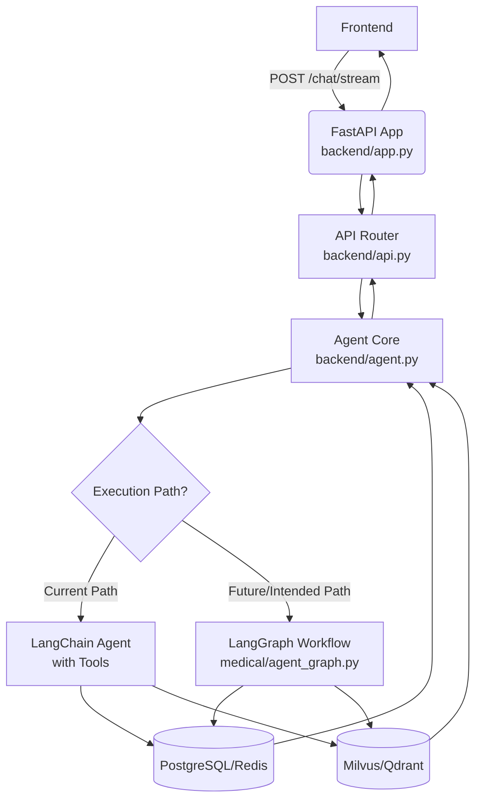

本文档深入剖析医疗助手项目的后端核心架构，该架构以 **FastAPI** 作为高性能 Web 框架，并采用 **LangGraph** 构建复杂的、状态驱动的智能体（Agent）工作流。这种组合为系统提供了强大的异步处理能力、清晰的 API 接口以及可编排、可观察的多步骤推理能力。

## 核心架构概览

后端系统遵循经典的分层架构模式，主要由以下部分构成：

1.  **入口层 (Entry Point)**: `backend/app.py` 负责创建和配置 FastAPI 应用实例，处理生命周期事件（如数据库初始化）、中间件（如 CORS）以及静态文件服务。
2.  **路由与 API 层 (Routing & API Layer)**: `backend/api.py` 定义了所有 RESTful API 端点，包括用户认证、会话管理、文档上传和核心的聊天接口 (`/chat` 和 `/chat/stream`)。此层是外部请求与内部业务逻辑的桥梁。
3.  **智能体核心层 (Agent Core Layer)**: `backend/agent.py` 封装了与 LangChain Agent 的交互逻辑。它负责加载对话历史、调用 Agent 并处理其响应。值得注意的是，当前实现似乎混合了传统的 LangChain Agent 和一个独立的 LangGraph 工作流（位于 `medical/` 目录），这可能是架构演进过程中的一个过渡状态。
4.  **LangGraph 工作流层 (LangGraph Workflow Layer)**: `medical/agent_graph.py` 定义了一个基于状态机的、有向无环图（DAG）形式的智能体工作流。该工作流能够根据用户查询的意图（情景记忆、语义记忆、知识图谱）动态地并行或串行执行不同的检索任务，最终合成答案。

整个数据流始于前端通过 `/chat/stream` 发起的请求，经由 API 层传递到 Agent 核心层，在那里触发 LangGraph 或 LangChain Agent 的执行，最终将结果流式返回给用户。

Sources: [app.py](backend/app.py#L1-L58), [api.py](backend/api.py#L1-L200), [agent.py](backend/agent.py#L1-L50)

## FastAPI 应用配置

FastAPI 应用的创建和配置集中在 `backend/app.py` 文件中。应用使用了 `lifespan` 上下文管理器来确保在启动时初始化数据库连接。为了支持前后端分离开发，应用通过 `StaticFiles` 中间件直接提供 `frontend/` 目录下的静态资源。同时，配置了宽松的 CORS 策略和开发环境下的无缓存策略，以简化调试流程。

应用的核心是通过 `app.include_router(api_module.router)` 将 `backend/api.py` 中定义的所有路由挂载到主应用上。这使得 API 的组织清晰且模块化。

Sources: [app.py](backend/app.py#L1-L58)

## API 接口与业务逻辑

`backend/api.py` 是后端功能的门面。它不仅处理用户认证（注册、登录、获取当前用户信息）和会话管理（列出、获取、删除会话），还暴露了两个关键的聊天接口：
-   `POST /chat`: 用于同步获取 Agent 的完整回复。
-   `POST /chat/stream`: 用于流式接收 Agent 的思考过程和最终回复，这是实现实时 RAG 可视化的基础。

当接收到聊天请求时，API 层会调用 `backend/agent.py` 中的 `chat_with_agent` 或 `chat_with_agent_stream` 函数。这些函数负责从 `ConversationStorage`（一个结合了 PostgreSQL 和 Redis 的存储类）中加载用户的对话历史，并将其与新的用户消息一起传递给底层的智能体执行引擎。

Sources: [api.py](backend/api.py#L1-L200)

## 智能体执行引擎：LangChain 与 LangGraph 的共存

目前的代码库揭示了一个有趣的架构特点：**LangChain Agent** 和 **LangGraph Workflow** 并存。

-   **当前执行路径**: 在 `backend/agent.py` 中，代码通过 `langchain.agents.create_agent` 创建了一个工具调用型 Agent (`chat_with_tools`)，并在 `chat_with_agent` 函数中通过 `agent.invoke(...)` 来执行它。这个 Agent 被赋予了多个工具，如 `search_knowledge_base` 和 `search_knowledge_graph`，用于执行具体的检索任务。

-   **未来/规划路径**: `medical/agent_graph.py` 文件则定义了一个更为精细和可控的 `StateGraph`。该图明确地将检索过程分为 `episodic_query`（情景记忆）、`semantic_query`（语义记忆）和 `neo4j_query`（知识图谱）三个潜在分支，并通过条件边（conditional edges）实现基于意图的动态路由。这种设计更适合复杂的、多阶段的推理场景，并且天然支持并行处理和状态追踪。

这种共存状态表明项目正处于从传统的、工具调用为主的 Agent 向更结构化、可编排的 Graph-based Agent 迁移的过程中。最终目标很可能是将 `medical/agent_graph.py` 中定义的工作流作为核心执行引擎。