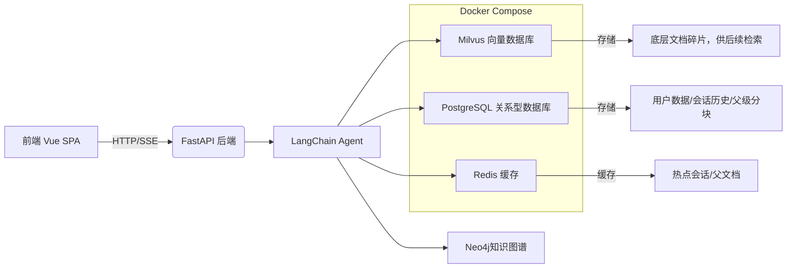

欢迎来到医疗智能助理！针对于目前大模型在医学领域幻觉严重，以及个人体检报告繁杂，药品说明书医学论文冗长晦涩，等问题，设计了这个智能助理项目！可以用户整理病历报告，记住药品说明书，以及解答各种疑难杂症！

## 核心目标与功能

个人医疗助理项目的核心目标是构建一个**安全、可靠、可解释**的个人医疗助理。它不仅仅是一个简单的问答机器人，而是通过结合用户上传的私人文档（如体检报告、病历）和内置的医疗知识库，为用户提供个性化的健康信息查询服务。其主要功能包括：

1.  **意图识别**：能够精准识别用户问题背后的多种潜在意图（如查询病因、治疗方法、所需药品等），从而提供更全面的回答。
2.  **智能问答**：用户可以就疾病、药品、症状等医疗相关问题进行提问。
3.  **私人情景记忆**：支持用户上传个人医疗文档体检报告等，系统会自动解析、分块并建立索引，后续问答可基于这些私有知识。
4.   **私人语义记忆**：支持用户上传晦涩的医疗论文、药品说明书等，系统会自动解析、分块并建立索引，后续问答可基于这些私有知识。
5.  **来源追溯**：所有回答都基于检索到的信息生成，并能在前端清晰地展示信息来源，确保回答的可验证性和可信度。

Sources: [README.md](README.md#L78-L90)

## 整体架构

医疗智能助理采用了前后端分离架构，后端以 Python 的 FastAPI 框架为核心，前端则是一个轻量级的单页应用（SPA）。整个系统围绕着一个强大的LangChain Agent工作流构建，该工作流负责协调检索、推理和生成等复杂任务。



如上图所示，用户的请求首先到达 FastAPI 后端，后端将任务交由 LangChain Agent 处理。Agent 会根据需要，从 Milvus（用于高效向量检索）、PostgreSQL（用于结构化数据存储）、Redis（用于高速缓存）、Neo4j（知识图谱云服务）中获取信息，并最终调用大语言模型（LLM）API 生成回答。所有依赖服务（数据库、缓存、向量库）均通过 `docker-compose.yml` 文件统一管理，极大地简化了部署流程。

Sources: [backend/app.py](backend/app.py#L1-L58), [README.md](README.md#L28-L60)

## 项目目录结构

了解项目的文件组织是深入代码的第一步。以下是 SuperMew 项目的关键目录及其作用：

```
.
├── backend/            # 后端核心逻辑
│   ├── app.py          # FastAPI 应用入口与配置
│   ├── api.py          # 所有 API 路由定义
│   ├── agent.py        # LangChain Agent 的核心实现
│   └── ...             # 数据库、认证、RAG 管道等模块
├── frontend/           # 前端静态资源 (HTML, JS, CSS)
├── docker-compose.yml  # 依赖服务 (Postgres, Redis, Milvus) 的容器编排文件
└── README.md           # 项目说明与部署指南
.
├── backend/                             # 后端核心逻辑
│   ├── app.py                           # FastAPI 应用创建与启动入口
│   ├── api.py                           # API 路由定义（聊天、上传、认证等）
│   ├── agent.py                         # LangChain / LangGraph Agent 组装与系统提示词
│   ├── auth.py                          # 用户认证、鉴权相关逻辑
│   ├── cache.py                         # 缓存层封装
│   ├── database.py                      # 数据库连接与初始化
│   ├── models.py                        # ORM / 数据模型定义
│   ├── schemas.py                       # Pydantic 请求/响应模型
│   ├── tools.py                         # Agent 可调用工具（知识库检索、知识图谱、天气等）
│   ├── upload_jobs.py                   # 文档上传、入库、删除等后台任务编排
│   ├── document_loader.py               # 文档加载与分块入口
│   ├── embedding.py                     # 稠密向量 / 稀疏向量嵌入服务
│   ├── milvus_client.py                 # Milvus 客户端封装，双知识库集合管理
│   ├── milvus_writer.py                 # 向量写入 Milvus 的逻辑
│   ├── parent_chunk_store.py            # 父级分块存储与查询
│   ├── rag_utils.py                     # 检索、重排、自动合并、查询扩展等通用 RAG 工具函数
│   ├── rag_pipeline.py                  # 主 RAG 检索流程（情景记忆 / 语义记忆路由）
│   ├── rag_pipeline 2.py                # 旧版/实验版 RAG 流程文件
│   ├── graphrag_pipeline.py             # 知识图谱检索流程编排
│   ├── neo4j_queries.py                 # Neo4j 查询与知识图谱上下文构造
│   ├── intent.py                        # 医疗意图识别
│   ├── ner_loader.py                    # NER 模型加载与实体识别调用
│   ├── test_kg_local.py                 # 本地知识图谱链路测试脚本
│   ├── model/                           # 本地 NER / BERT 模型资源
│   │   ├── best_roberta_rnn_model_ent_aug.pt
│   │   ├── roberta.txt
│   │   └── chinese-roberta-wwm-ext/
│   │       ├── config.json
│   │       ├── pytorch_model.bin
│   │       ├── tokenizer.json
│   │       ├── tokenizer_config.json
│   │       └── vocab.txt
│   └── __pycache__/                     # Python 编译缓存
│
├── frontend/                            # 前端静态资源
│   ├── index.html                       # 前端页面入口
│   ├── script.js                        # 前端交互逻辑
│   └── style.css                        # 前端样式
│
├── data/                                # 项目数据与测试资源
│   ├── bm25_state.json                  # BM25 统计状态
│   ├── bm25_state_medical_record.json   # 情景记忆 BM25 状态
│   ├── bm25_state_medication.json       # 语义记忆 BM25 状态
│   ├── documents/                       # 上传或测试用文档样本
│   │   └── xxx.pdf
│   ├── ent_aug/                         # 医疗实体增强词表
│   │   ├── 检查项目.txt
│   │   ├── 治疗方法.txt
│   └────── ...
├── volumes/                             # Docker 挂载卷（本地持久化数据）
│   ├── etcd/                            # Milvus 依赖 etcd 数据
│   ├── minio/                           # Milvus 依赖对象存储数据
│   ├── milvus/                          # Milvus 本体数据
│   ├── postgres/                        # PostgreSQL 数据目录
│   └── redis/                           # Redis 持久化数据
├── .env                                 # 本地环境变量
├── .env.example                         # 环境变量示例
├── pyproject.toml                       # Python 项目配置与依赖
└── docker-compose.yml                   # Postgres / Redis / Milvus / MinIO / Etcd / 

```

